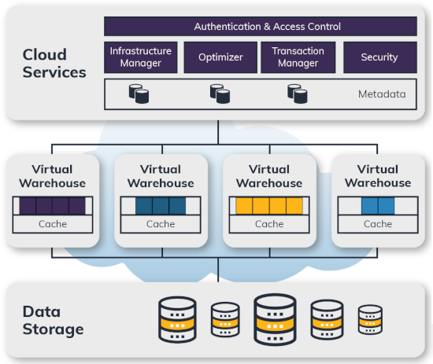
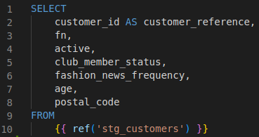
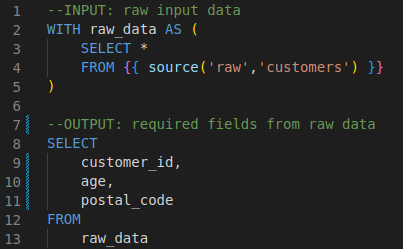
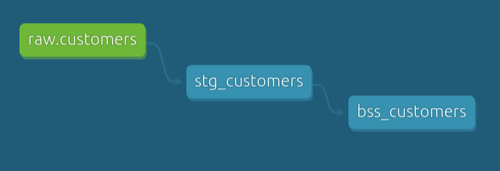
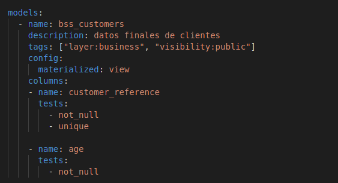
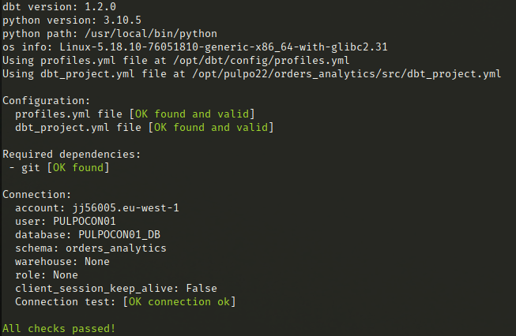

<!-- header -->
<h1 align="center">Pulpocon 2022 · Construyendo pipelines de datos a escala</h1>

<div style="font-size: 0.8em; letter-spacing: 0.1em;"> 
    <p align="right">
        <a  href="../README.md" target="_top">inicio</a>
        &nbsp;&nbsp;·&nbsp;&nbsp;
        <a href="../01-procesando-en-capas/README.md" target="_top">siguiente</a>
    </p>
    <p>&nbsp;</p>
</div>

<!-- content -->
## Presentando Snowflake y dbt

Para dar respuesta a la necesidad de capturar grandes volúmenes de datos, su almacenaje y su análisis, han surgido a lo largo de los años multitud de sistemas especializados en estas tareas. Desde *frameworks* de procesamiento distribuido como [Hadoop](https://hadoop.apache.org/) que en su momento revolucionaron la industria y todavía hoy siguen vigentes, pasando por infinidad de librerías enfocadas en tareas concretas como la carga y extracción de dato, hasta llegar a sistemas de procesamiento cercano al tiempo real como [Apache Spark](https://spark.apache.org/), [Apache Flink](https://flink.apache.org/) o [Kafka Streams](https://kafka.apache.org/documentation/streams/), y a *data warehouses* de nueva generación totalmente enfocados en el *cloud*.

A lo largo de todo este tiempo, la necesidad de trasformar el dato desde su estado más puro (*raw data*) hasta aquel donde el usuario de negocio pueda ser capaz de extraer verdadero valor de él (*processed data*), no solo se ha mantenido intacta, sino que cada vez se ha ido incrementando la demanda de que ese proceso se realice de forma más ágil, rápida y flexible. Las herramientas de ETL/ELT (*Extract, Transform, Load*) encargadas de llevar a cabo esta tarea se han convertido en una pieza fundamental en cualquier arquitectura orientada a datos, y han sufrido una clara y definitiva evolución a lo largo de los últimos años.

Del mismo modo, los sistemas de almacenamiento de información han cambiado drásticamente desde un enfoque muy centrado en el uso de *software* y *hardware* especializado, caro y complejo de mantener; hacia la utilización de componentes de propósito general que aprovechan el éxito de las tecnologías *cloud* y el constante crecimiento en cuanto a capacidad de procesamiento de los sistemas, para ofrecer unos servicios de almacenamiento de datos con enormes cualidades de esacalabilidad y rendimiento.

En este taller combinaremos dos tecnologías que son claramente tendencia en el mercado: **Snowflake**, como base de datos analítica, y **dbt**, como *framework* de transformación de datos; para discutir acerca de los pilares que nosotros entendemos como imprenscindibles a la hora de construir una *pipeline* de datos robusta y eficiente.


### Snowflake, *data warehouse* de nueva generación

Snowflake es un *data warehouse* SQL ofrecido como un servicio *cloud* totalmente gestionado que nos permite almacenar y analizar dato, tanto estructurado (modelo relacional clásico) como semi-estructurado (ficheros parquet, avro, json, etc.), de una forma eficiente y con un grado de escalabilidad casi ilimitado. Funciona como una plataforma *SaaS* (*Software as a Service*) donde no se requiere ningún tipo de gestión de *hardware*, *software* o mantenimiento por parte de los usuarios; y utiliza como infraestructura cualquiera de las tres grandes nubes del mercado: AWS, Azure o Google Cloud.

Los principales puntos fuertes de Snwoflake derivan de su arquitectura multi-capa, especialmente de la separación entre cómputo (en forma de *virtual warehouses*) y persistencia (como un *object-storage* en formato columnar y con compresión automática). Sobre estas dos capas Snowflake ofrece una serie de servicios encargados de la optimización de las consultas realizadas contra los datos, la seguridad o la gestión de transacciones.


<p><em>Fig - Arquitectura de Snowflake</em></p>

Las capas de almacenamiento y cómputo pueden escalar de forma independiente. Además de esto, cada uno de los *virtual warehouses* que acceden y procesan el dato se comportan como sistemas *MPP* (*massively parallel processing*) totalmente aislados entre sí, por lo que no compiten en recursos; ofreciendo la posibilidad de escalar, tanto vertical como horizontalmente, cualquier flujo de transformación de datos casi de forma infinita e instantánea. Es importante destacar que, a diferencia de *data warehouses* más tradicionales, en Snowflake incrementar la capacidad de cómputo es algo inmediato; modificar las características del *virtual warehouse* utilizado para ejecutar una consulta concreta es un proceso que no require más que un cambio de configuración, y no lleva asociado ningún tipo de despliegue o tiempo de corte en el servicio.


### dbt, *framework* para la transformación de datos

Dbt es una librería *open source*, basada en Python y SQL, que se ha convertido en uno de los estándares de la industria para la transformación de datos. Dbt se centra en la *“T”* de un proceso ELT. Es decir, una vez que los datos están cargados en el repositorio de información (BigQuery, Snowflake, Redshift…) permite escribir las transformaciones, utilizando sintaxis SQL, que ejecutará el motor de base de datos para construir los *datasets* finales que contengan el dato transformado.

La utilización de SQL como sintaxis hace de dbt una herramienta accesible no solo a equipos de desarrolladores de *software*, sino también a perfiles más cercanos a la analítica de datos, para los que lenguajes de más alto nivel como Scala, o incluso Python, pueden suponer una barrera de entrada. Además, sigue la tendencia del mercado que sitúa a SQL como una especie de *lingua franca* en el ecosistema de los datos, donde cualquier librería de procesamiento ofrece un API de entrada basada en SQL como forma de modelar transformaciones de datos de forma declarativa.


<p align="center"><em>Fig - El flujo de trabajo de la ingeniería analítica</em></p>

Pero dbt no se ocupa únicamente de la definición de las transformaciones, sino que se presenta como un *framework* completo que ayuda a gestionar una *pipeline* de datos de una forma muy similar a la que gestionaríamos el ciclo de vida de un proyecto *software* cualquiera, esto es: añadiendo la capacidad de orquestar nuestros flujos, testear el comportamiento de nuestras transformaciones o documentar la información que generamos. Todo ello construido en base a repositorios de código versionables, modulares, con soporte para escenarios multi-entorno y compatible con cualquier flujo de CI/CD.


#### Modelos en dbt

Un **modelo** en dbt representa cada una de las transformaciones de datos que queremos realizar y se compone de:
- una sentencia SELECT, que se encargará de definir la modificación a realizar sobre los datos
- una serie de metainformación que nos permite definir cómo este debe ser materializado en la base de datos

Los modelos, por lo tanto, se corresponderán con objetos en la persistencia: tablas y vistas, y serán definidos únicamente en base a sentencias SELECT. A partir de dicha definición, toda la comunicación con la BD y la gestión de las sentencias *DDL* (*Data Definition Launguage*) requeridas para su construcción, será responsabilidad del propio dbt.

A la hora de decidir cómo materializar un modelo, por defecto dbt nos permite seleccionar entre las siguientes posibilidades: 

- **view**: el modelo se construye como una vista en la base de datos 
- **table**: el modelo se construye como una tabla en la base de datos 
- **incremental**: el modelo se crea inicialmente como una tabla en la que sucesivas ejecuciones del modelo serán tratadas como insercciones y actualizaciones de datos
- **ephemeral**: el modelo no se crea directamente en la base de datos, sino que se crea como un *CTE* (*Common Table Expression*) reutilizable

Además, durante la construcción de un modelo podemos necesitar recuperar datos de modelos previamente construidos o información ya existente en la base de datos. Para ello, dbt nos ofrece un par de expresiones que utilizaremos como parte de nuestra sentencia SELECT:

- `{{ ref('') }}`: cuando queramos referenciar información producida por un modelo anterior
- `{{ source('', '') }}`: cuando queramos recuperar datos directamente desde la base de datos


<p><em>Fig - Modelo referenciando a otro previo con nombre 'stg_customers'</em></p> 


<p><em>Fig - Modelo recuperando datos de una tabla existente en bd</em></p> 
 
Estas expresiones se implementan como macros [Jinja](https://jinja.palletsprojects.com/en/3.1.x/) y ofrecen información a dbt acerca de las dependencias existentes entre modelos y, por lo tanto, la secuencia en la que deben ser construidos y cómo deben ser enlazados.


<p><em>Fig - DAG de tres modelos enlazados</em></p>


#### Tests en dbt

Una pipeline de transformación siempre resulta compleja de probar, ya que los datos subyacentes cambian con frecuencia y la volumetría de los mismos suele suponer un reto a la hora de realizar validaciones. Dbt nos proporciona mecanismos para definir y ejecutar tests sobre los resultados de nuestros modelos, de forma que podamos monitorizar y garantizar la integridad del código SQL de cada uno de ellos.


<p><em>Fig - YAML de configuración de un modelo definiendo tests de datos sobre alguna de sus columnas</em></p>

De una forma puramente declarativa podemos definir testes que validen el esquema y los datos de nuestros modelos; así como definir expresiones SQL, nuevamente sentencias SELECT, que nos permitan cubrir la lógica de negocio específica de nuestra organización: cualquier aserción que necesitemos hacer sobre un modelo en forma de consulta SQL se puede construir como un test en dbt y este puede ser evaluado como un paso más de nuestra *pipeline* de transformación de datos.


### :octopus:	Conectando Snowflake y dbt

A lo largo del taller utilizaremos tanto dbt como Snowflake para desarrollar y ejecutar los distintos casos prácticos sobre los que iremos debatiendo. Para poder hacer esto, debemos, en primer lugar, configurar nuestro proyecto local de dbt para que pueda conectarse con una base de datos *cloud* en Snowflake. Seguiremos los siguientes pasos para establecer esa conexión:

1. **obtener nuestras credenciales de Snowflake**

- Entraremos en el siguiente enlace: [credenciales Snowflake](https://docs.google.com/spreadsheets/d/1eMp4_f70uUobTvEfM2Guq4qalw8CP-sxfIc20pXsNRo/edit?usp=sharing) y anotaremos nuestro nombre en la columna *"Persona que utiliza la cuenta"* para reservar un juego de credenciales de cara a la realización del taller [^credenciales-tras-pulpocon22]

2. **configurar credenciales como variables de entorno**

 - copiaremos ahora el contenido de la columna *"Variables de entorno a configurar"* que aparece a la izquierda de nuestro nombre en el la hoja de cálculo del punto anterior
 - abriremos un terminal en nuestro equipo y nos situaremos en la carpeta en la que hayamos clonado este repositorio
 - pegaremos el contenido de la columna en el terminal abierto y ejecutamos la sentencia para fijar las variables de entorno necesarias
 - como resultado, se habrán creado las siguientes variables de entorno. En caso de error las podemos cubrir a mano con los valores que aparecen en la hoja de cálculo:
   - SNOWFLAKE_ACCOUNT
   - SNOWFLAKE_DATABASE
   - SNOWFLAKE_USER
   - SNOWFLAKE_PASSWORD


3. **acceder a la *shell* de desarrollo de dbt**

 - ahora, desde el *path* del repositorio git clonado, ejecutaremos el siguiente comando:
    ```bash
    make shell
    ```
 - esto nos generará un *shell* dockerizado con toda la configuración necesaria para ejecutar nuestro proyecto dbt. Una vez finalizada la construcción del contenedor docker deberíamos ver lo siguiente:
  
    ```bash
      Construyendo pipelines de datos a escala
      ~~~~~~~~~~~~~~~~~~~~~~~~~~~~~~~~~~~~~~~~

      Contenedor con cliente dbt listo para ser utilizado durante el taller.
      Ejecuta 'exit' para salir y eliminar el contenedor en cualquier momento.

      Proyecto dbt 'orders_analytics':
      · src: pipeline de transformación de datos
      · test: tests unitarios
    ```
  
4. **testear la conectividad con Snowflake**

 - finalmente, desde dentro de la *shell* creada en el punto anterior, nos situaremos en la carpeta `src` y ejecutaremos el comando `dbt debug`:
  
    ```bash
    cd src
    dbt debug
    ```

  - se hará un test de conectividad donde el resultado debe indicar que todas las validaciones han sido correctas:
    
    
    

A partir de aquí esteremos listos para comenzar a ejecutar todos los casos prácticos que veremos a lo largo del taller. 
En la columna `Snowflake Console URL` del enlace del que hemos obtenido las credenciales, se indica una URL de acceso a la consola de Snowflake; utilizaremos esta dirección en distintos momentos del taller siempre que necesitemos ejecutar consultas o comprobar resultados en Snowflake.

---

[^credenciales-tras-pulpocon22]: 
**NOTA:** los usuarios utilizados durante la PulpoCon 2022 pueden haber caducado y no estar ya disponibles. Si esto fuese así, puedes realizar igualmente el taller utilizando uno de estos dos métodos:

- generando una cuenta de prueba de 30 días en Snowflake: https://signup.snowflake.com/ de forma totalmente gratuita y solo requiriendo una dirección de correo electrónico para ello. Una vez generada la cuenta, debes actualizar los campos referentes a Snowflake en el fichero `config/dbt/profiles.yml` de este repositorio, utilizando los valores correctos para tu nueva cuenta Necesitarás lo siguiente, todo ello creado en Snowflake junto a tu nueva cuenta:
  - el identificador de la cuenta creada: `account`
  - un nombre de usuario: `user`
  - una contraseña: `password`
  - una base de datos existente en Snowflake: `database`
  - un rol vinculado a tu usuario y con permisos de acceso a la base de datos anterior: `role`
  - un *warehouse* existente en Snowflake y accesible a tu usuario: `warehouse`
      
  Una vez configurada esta información podrías continuar esta guía desde el `paso 3` con normalidad.

- prescindiendo de Snowflake y utilizando en su lugar una base de datos PostgreSQL local que forma parte también del repositorio. En este caso no podrás realizar las prácticas específicas de Snowflake, como las que se detallan en la sección de *"Estrategias ante grandes volumetrías de datos"*, pero sí el resto de apartados. Estos serían los pasos a realizar si optas por esta opción:
  1. editar el fichero `config/dbt/profiles.yml` para configurar el valor: `target: local` en las líneas 3 y 25, en lugar del existente Snowflake.
  2. ejecutar el comando `make start-dev` desde la carpeta raíz de este repositorio para arrancar la instancia local de PostgreSQL
  
  Una vez hecha esta configuración podrías continuar esta guía desde el `paso 3` con normalidad. En el apartado *"Ejecución de macro load_raw_data"* de la sección *"Procesamiento en capas"* se te pedirá que ejecutes un comando dbt especial, en lugar de la macro que normalmente se pide ejecutar en ese punto.

<!-- footer -->
<p>&nbsp;</p>
<p>&nbsp;</p>
<hr/>
<div style="font-size: 0.8em; letter-spacing: 0.1em;"> 
    <p align="right">
        <a  href="../README.md" target="_top">inicio</a>
        &nbsp;&nbsp;·&nbsp;&nbsp;
        <a href="../01-procesando-en-capas/README.md" target="_top">siguiente</a>
    </p>
    <p>&nbsp;</p>
</div>
<div style="font-size: 0.8em; letter-spacing: 0.1em;"> 
  <p align="right"><strong>Pulpocon · 2022</strong><br/>Construyendo pipelines de datos a escala</p>
  <p align="right"><code>rosa@nextail.co</code><br/><code>david.macia@nextail.co</code></p>
</div>
