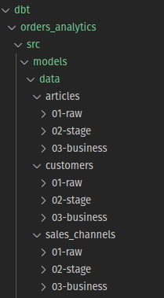
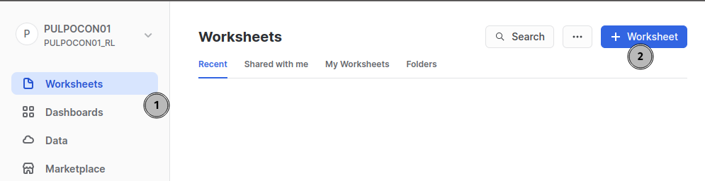
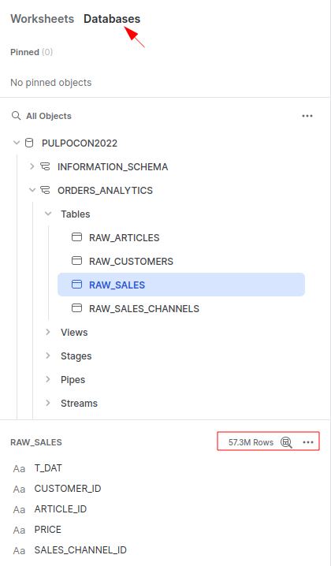
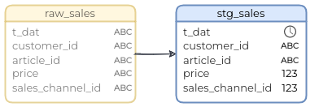
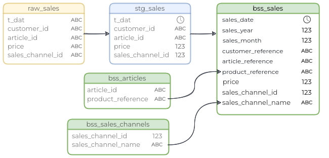

<!-- header -->
<h1 align="center">Pulpocon 2022 · Construyendo pipelines de datos a escala</h1>

<div style="font-size: 0.8em; letter-spacing: 0.1em;"> 
    <p align="right">
        <a  href="../README.md" target="_top">inicio</a>
        &nbsp;&nbsp;·&nbsp;&nbsp;
        <a href="../00-introduccion-snowflake-dbt/README.md" target="_top">anterior</a> / 
        <a href="../02-documentando-la-pipeline/README.md" target="_top">siguiente</a>
    </p>
    <p>&nbsp;</p>
</div>

Esta sección requiere haber hecho la configuración indicada en el apartado anterior para poder interactuar con Snowflake adecuadamente. Por favor, si no lo has hecho, ejecuta los pasos descritos en el apartado [conectando Snowflake y dbt](../00-introduccion-snowflake-dbt/README.md#octopusconectando-snowflake-y-dbt).

<!-- content -->
## Procesamiento en capas
Tal y como ya hemos comentado, cualquier proceso de análisis de datos sobre grandes volúmenes se construye hoy en día como una secuencia de tareas en la que intervienen varios actores. Desde un punto de vista de arquitectura, cada uno de estos sistemas son piezas enfocadas en una labor concreta y en las que se aplican técnicas y tecnologías especializadas en llevar a cabo esa tarea. Se parte de un problema complejo, se divide este en partes y se define la responsabilidad concreta de cada una de esas partes para poder solucionarlas de forma efectiva.

Si de todo el proceso hacemos foco en la etapa de transformación de datos, los mismos principios vuelven a aplicar. Una *pipeline* de procesamiento de información puede dividirse en distintas capas, cada una de ellas con una función específica y resuelta de una forma particular. Aplicando esta técnica buscamos:

- **generar patrones en nuestro procesamiento**: cada capa se especializa en aplicar una cierta lógica, sea cual sea la fuente de información a tratar
- **hacer más mantenible nuestro código**: cada etapa tiene un objetivo marcado y puede ser testeada individualmente
- **ganar en flexibilidad**: incorporar nuevas funcionalidades en nuestro procesado se convierte en añadir nuevas capas a la *pipeline* final
- **posibilitar la paralelización**: al haber troceado el problema en partes, cada una de estas partes podría llegar a ser ejecutada de forma concurrente cuando no existen dependencias entre ellas
  
A continuación nos apoyaremos en dbt para construir un proceso de transformación de datos en capas que nos acerque a los objetivos que hemos establecido en los puntos anteriores. 

### Capas en el proyecto Orders Analytics
Dentro de la carpeta `dbt/orders_analytics/src` del repositorio, encontramos un proyecto dbt en el que se han construido una serie de modelos para procesar los datos de clientes y productos de nuestro caso de uso. Estos modelos han sido divididos en tres capas diferentes:

- **capa raw**: en la que almacenamos el *dato crudo* recibido, es decir, dato sin ningún tipo de transformación aplicada sobre él
- **capa stage**: en la que limpiamos la info recuperada desde la capa anterior, fijamos sus tipos de datos y ajustamos formatos
- **capa business**: en la que aplicamos lógica de negocio y transformamos el dato de la capa *stage* en dato listo para ser consumido

Estas mismas tres capas se han definido para los distintos tipos de datos existentes:
- para *articles*, en la ruta `models/data/articles`
- para *customers*, en la ruta `models/data/customers`
- para *sales_channels*, en la ruta `models/data/sales_channels`
  

<p><em>Fig - capas sobre cada tipo de datos</em></p>

Utilizando dbt, las diferentes capas se han modelado como una sentencia *select SQL* específica para el tipo de datos concretos que están transformando y la lógica a aplicar en la capa concreta. Además, recuperan información de la capa previa para construir, de este modo, un proceso de transformación de datos incremental que aplica las mismas etapas sobre cada uno de los tipos de datos a procesar.

### Añadiendo los datos de ventas
Para completar nuestro caso de uso aplicaremos ahora el mismo concepto de capas, pero sobre los datos de ventas de los que disponemos.

Dentro del proyecto `dbt/orders_analytics/src` existe un directorio `data/sales` en el que se ha generado la primera de sus capas: *01-raw*. Esta primera capa está definida como un *source* de dbt; simplemente hace referencia a datos recogidos desde una fuente externa y almacenados en una tabla concreta de la base de datos, sin aplicar ningún tipo de transformación.

Simulemos, ahora, la carga de datos externos en esta capa *raw* y continuemos construyendo el resto de capas necesarias para procesar los datos de ventas ingestados.

#### Poblando de datos la capa *raw*

Tal y como hemos comentado, nuestra primera capa *raw* es el destino de los datos, en crudo y sin procesar, que habremos extraído desde un sistema externo. Para nuestro caso de uso los datos serán recuperados desde un *bucket* de S3 y persistidos directamente en las tablas adecuadas de Snowflake. 

Ese proceso lo hemos automatizado empleando una *macro* definida en nuestro proyecto dbt, por lo que para su ejecución solamente tendremos que seguir los siguientes pasos:

<details>

<summary> :octopus: <strong>Ejecución de macro <em>load_raw_data</em></strong></summary>

1. desde la misma *shell* desde la que hemos hecho el test de conectividad con Snowflake, y estando situados en la carpeta `src` de nuestro proyecto, ejecutaremos los siguientes comandos: 
   
```bash
cd /opt/pulpo22/orders_analytics/src
dbt deps
```

```bash
dbt run-operation load_raw_data
```

    NOTA: si y solo si estuvieses utilizando la base de datos PostgreSQL local en lugar de Snowflake, deberás ejecutar el comando: "dbt seed" en sustitución del previamente comentado dbt run-operation. Este comando "dbt seed" cargará unos datos locales de prueba que tendrán una volumetría muy inferior a los originales, pero que te permitirán seguir con el taller sin necesidad de una cuenta en Snowflake.

El primero de ellos, `dbt deps`, se encargará de recuperar todas las dependencias que nuestro proyecto dbt requiere para su funcionamiento, mientras que el comando `dbt run-operation` lanzará la carga de los datos *raw* de nuestro caso de uso:

~~~bash
Running with dbt=1.2.0
Load raw data: 
** profile_name: orders_analytics
** target.name: snowflake
** target.type: snowflake
** target.schema: orders_analytics

- loading data for node 'raw_customers'
| file                                    | status | rows_parsed | rows_loaded | error_limit | errors_seen | ... |
| --------------------------------------- | ------ | ----------- | ----------- | ----------- | ----------- | --- |
| s3://pulpocon-2022/raw/customers.csv.gz | LOADED |   1,371,980 |   1,371,980 |           1 |           0 | ... |

- loading data for node 'raw_sales_channels'
| file                                      | status | rows_parsed | rows_loaded | error_limit | errors_seen | ... |
| ----------------------------------------- | ------ | ----------- | ----------- | ----------- | ----------- | --- |
| s3://pulpocon-2022/raw/sales_channels.csv | LOADED |           2 |           2 |           1 |           0 | ... |

- loading data for node 'raw_sales'
| file                                            | status | rows_parsed | rows_loaded | error_limit | errors_seen | ... |
| ----------------------------------------------- | ------ | ----------- | ----------- | ----------- | ----------- | --- |
| s3://pulpocon-2022/raw/sales/sales_0_2_0.csv.gz | LOADED |   4,886,345 |   4,886,345 |           1 |           0 | ... |
| s3://pulpocon-2022/raw/sales/sales_0_3_0.csv.gz | LOADED |   5,128,570 |   5,128,570 |           1 |           0 | ... |
| s3://pulpocon-2022/raw/sales/sales_0_1_0.csv.gz | LOADED |   5,587,511 |   5,587,511 |           1 |           0 | ... |
| s3://pulpocon-2022/raw/sales/sales_0_1_1.csv.gz | LOADED |   1,621,449 |   1,621,449 |           1 |           0 | ... |
| s3://pulpocon-2022/raw/sales/sales_0_4_0.csv.gz | LOADED |   5,442,108 |   5,442,108 |           1 |           0 | ... |
| s3://pulpocon-2022/raw/sales/sales_0_2_1.csv.gz | LOADED |   1,921,207 |   1,921,207 |           1 |           0 | ... |
| s3://pulpocon-2022/raw/sales/sales_0_4_1.csv.gz | LOADED |   1,639,766 |   1,639,766 |           1 |           0 | ... |
| s3://pulpocon-2022/raw/sales/sales_0_6_1.csv.gz | LOADED |   1,291,378 |   1,291,378 |           1 |           0 | ... |
| s3://pulpocon-2022/raw/sales/sales_0_7_1.csv.gz | LOADED |   1,162,011 |   1,162,011 |           1 |           0 | ... |
| s3://pulpocon-2022/raw/sales/sales_0_0_1.csv.gz | LOADED |   2,229,462 |   2,229,462 |           1 |           0 | ... |
| s3://pulpocon-2022/raw/sales/sales_0_5_0.csv.gz | LOADED |   5,862,125 |   5,862,125 |           1 |           0 | ... |
| s3://pulpocon-2022/raw/sales/sales_0_3_1.csv.gz | LOADED |   2,248,326 |   2,248,326 |           1 |           0 | ... |
| s3://pulpocon-2022/raw/sales/sales_0_5_1.csv.gz | LOADED |   1,217,572 |   1,217,572 |           1 |           0 | ... |
| s3://pulpocon-2022/raw/sales/sales_0_6_0.csv.gz | LOADED |   5,775,391 |   5,775,391 |           1 |           0 | ... |
| s3://pulpocon-2022/raw/sales/sales_0_0_0.csv.gz | LOADED |   5,435,006 |   5,435,006 |           1 |           0 | ... |
| s3://pulpocon-2022/raw/sales/sales_0_7_0.csv.gz | LOADED |   5,897,953 |   5,897,953 |           1 |           0 | ... |

- loading data for node 'raw_articles'
| file                                   | status | rows_parsed | rows_loaded | error_limit | errors_seen | ... |
| -------------------------------------- | ------ | ----------- | ----------- | ----------- | ----------- | --- |
| s3://pulpocon-2022/raw/articles.csv.gz | LOADED |     105,542 |     105,542 |           1 |           0 | ... |
~~~

La orden `load_raw_data` ejecuta una macro, definida en nuestro proyecto dbt, que indica a Snowflake cómo debe acceder a un *bucket* de S3 para descargar e ingestar los datos *raw* de nuestro caso de uso. Estos datos están almacenados en forma de ficheros CSV en S3; Snowflake leerá el contenido de cada uno de los ficheros y extraerá de ellos los datos solicitados. Toda esta comunicación se realiza directamente entre Snowflake y S3, sin que intervenga nuestra conexión a la red salvo en el momento de la invocación del comando. 

El resultado final será la carga de todo nuestro dato *raw* de prueba, tanto para ventas como para el resto de tipos de datos de nuestro caso de uso. Podemos ahora acceder a la consola de Snowflake y ejecutar unas consultas para comprobar que la información ha sido persistida en las tablas esperadas. Para ello:

2. accederemos a través de la `Snowflake Console URL` correspondiente a nuestro usuario y que podemos consultar en el fichero desde el que hemos obtenido [nuestras credenciales](../00-introduccion-snowflake-dbt/README.md#octopusconectando-snowflake-y-dbt). Utilizaremos para el *login* el mismo usuario y contraseña (PULPOCONXX) que ya hemos empleado anteriormente para configurar nuestra *shell*
   
3. en el menú izquierdo seleccionaremos la opción `Worksheets` y crearemos un nuevo área de trabajo utilizando el botón de la esquina superior derecha:



4. en el área de trabajo creada podremos navegar por las distintas tablas existentes en el *schema* `orders_analytics` que usaremos a lo largo del taller, y ejecutar sobre él nuestras propias consultas:



~~~sql
-- Datos "raw" de clientes
select * from orders_analytics.raw_customers
limit 50;

-- Datos "raw" de artículos
select * from orders_analytics.raw_articles
limit 50;

-- Datos "raw" de canales de venta
select * from orders_analytics.raw_sales_channels;

-- Datos "raw" de ventas
select * from orders_analytics.raw_sales
limit 50;
~~~

Es importante tener en cuenta que estamos trabajando contra volúmenes de datos importantes, por lo que hacer consultas sin una cláusula `WHERE` o `LIMIT` para reestringir la cantidad de resultados devueltos, puede hacer que estemos lanzando ejecuciones costosas y los tiempos de ejecución se vean incrementados en consecuencia.
  
</details>

#### Capa *stage* de ventas

La segunda de nuestras capas, la capa *stage*, tomará los datos de la capa *raw* anterior correspondiente a los datos de ventas y debe cumplir una serie de objetivos:
- se encargará de **limpiar**, **ajustar formatos y** definir **tipos de datos**
- **no debe contener lógica de negocio**, únicamente procesamiento que tenga que ver con la tarea de limpieza del dato
- **no depender de ningún otro tipo de dato** que no sean las ventas de la capa *raw*. Es importante mantener las ditintas fuentes de datos (ventas, artículos, clientes, etc.) independientes entre sí en estas primeras etapas del procesado



El resultado final debe ser una `vista` en la base de datos que cumpla los siguientes requisitos:
- el nombre de la tabla generada será `stg_sales`, para mantener la coherencia en la nomenclatura dentro del proyecto
- debe exponer los mismos datos que la tabla *raw* de ventas
- el campo `t_dat`, que representa la fecha en la que se produjo la venta, debe ser tratado como un tipo `DATE`
- los campos con datos numéricos: `price` y `sales_channel_id` deben ser tratados como numéricos

A lo largo de los siguientes pasos iremos construyendo el modelo, podemos utilizar cualquier editor de texto para crear y editar los ficheros necesarios y, a la hora de ejecutar comandos dbt, lo haremos desde la misma *shell* desde la que ya hemos ejecutado anteriormente la carga de datos inicial.

<details>
<summary> :octopus: <strong>Inicializar modelo stg_sales en dbt</strong></summary>

1. editaremos el fichero `stg_sales.sql`, actualmente vacío,dentro de la ruta: 
  `orders_analytics/src/model/data/sales/02-stage/`

2. escribiremos en él la sentencia SQL que transforme los datos:

~~~sql
--INPUT: raw input data
WITH raw_data AS (
    SELECT *
    FROM {{ source('raw','sales') }}
)

--OUTPUT: data cleaned and with casting applied
SELECT
    t_dat::DATE AS t_dat,
    customer_id,
    article_id,
    price::DECIMAL(11,2) AS price,
    sales_channel_id::INTEGER AS sales_channel_id
FROM
    raw_data
~~~

En la definición SQL del modelo incluímos el uso de:
- la macro `source` para indicar la fuente de datos de la que depende nuestro modelo
- el uso de un `CTE` ([Common Table Expression](https://docs.getdbt.com/terms/cte)) utilizando el bloque `WITH` de SQL, para ganar en legibilidad y rendimiento cuando utilizamos motores de base de datos orientados a la analítica.
  
</details>

<details>
<summary> :octopus: <strong>Configurar el modelo para que sea materializado como una vista</strong></summary>

Una vez que hemos definido la sentencia *select* que implementa la transformación que queremos realizar en esta etapa *stage*, añadiremos ahora cierta metainformación que indique a dbt cómo debe materializar el modelo en la base de datos.

1. editaremos el fichero `stg_sales.yml`, actualmente vacío, dentro de la ruta: 
  `orders_analytics/src/model/data/sales/02-stage/`

2. escribiremos en él la metainformación adecuada:

~~~sql
version: 2

models:
  - name: stg_sales
    description: dato de ventas limpio y con conversión de tipos de datos aplicada
    config: 
      tags: ["layer:stage"]
      materialized: view
~~~

Siguiendo el formato que nos marca dbt, añadimos una breve descripción a la definición del modelo, le vinculamos un *tag* que identifique la capa a la que pertenece y, en el bloque específico de configuración, fijamos su tipo de materialización a `view`.
 
</details>

<p>&nbsp;</p>

Es importante destacar un concepto sencillo pero muy potente: apoyándonos en dbt hemos diferenciando entre la transformación que ejecuta el modelo (nuestra sentencia SQL) y cómo el resultado debe ser materializado en la base de datos. De forma totalmente declarativa, cambiando el tipo de materialización, podemos indicar al *framework* cómo debe interactuar con el motor de base de datos.

#### Capa *business* de ventas

La tercera de nuestras capas, la capa *business*, tomará los datos de la capa *stage* que acabamos de generar y aplicará sobre ellos una transformación que deje el dato listo para ser consumido. Para ello, debe cumplir los siguientes objetivos:

- se encargará de aplicar **lógica de negocio**, si fuese el caso, para crear nuevos campos derivados de los existentes en la capa *stage*
- puede **cruzar información** con otras fuentes de datos para enriquecer el modelo
- debe **normalizar** los nombres de los campos que expone, de forma que estos representen correctamente los conceptos de negocio que manejen los consumidores de la información



El resultado final debe ser una `tabla física` que cumpla los siguientes requisitos:
- el nombre de la tabla generada será `bss_sales`, para mantener la coherencia en la nomenclatura dentro del proyecto
- debe exponer los mismos datos que la tabla *stage* de ventas, pero con sus nombres normalizados:

    |campo en *stg*|campo en *bss*|
    |--------------|---------------|
    |t_dat|sales_date|
    |customer_id|customer_reference|
    |article_id|article_reference|
    |price|price|
    |sales_channel_id|sales_channel_id|

- el campo `t_dat`, que representa la fecha en la que se produjo la venta, debe ser descompuesto en los siguientes, para facilitar su explotación:

    |campo|descripción|
    |-----|-----------|
    |sales_year|año en el que se produjo la venta|
    |sales_month|mes en el que se produjo la venta|

- debe contener un campo `product_reference` en el figure la referencia del producto al que pertenece un artículo vendido
- debe contener un campo `sales_channel_name` en el figure el nombre del canal de venta utilizado para realizar la venta

A lo largo de los siguientes pasos iremos construyendo el modelo, tal y como hemos hecho para la capa anterior.

<details>
<summary> :octopus: <strong>Inicializar modelo bss_sales en dbt</strong></summary>

1. editaremos el fichero `bss_sales.sql`, actualmente vacío, dentro de la ruta: 
  `orders_analytics/src/model/data/sales/03-business`:

2. escribiremos en él la sentencia SQL que transforme los datos:

~~~sql
/*
    Include some denormalized data from sales_channels and articles
    to avoid extra joins in the descendant models
*/
SELECT
    EXTRACT(year FROM t_dat)::INTEGER AS sales_year,
    EXTRACT(month FROM t_dat)::INTEGER AS sales_month,
    ss.t_dat AS sales_date,
    ss.customer_id AS customer_reference,
    ss.article_id AS article_reference,
    ba.product_reference,
    price,
    ss.sales_channel_id,
    bsc.sales_channel_name
FROM
    {{ ref('stg_sales') }} ss
JOIN
    {{ ref('bss_articles') }} ba ON ba.article_reference = ss.article_id
JOIN
    {{ ref('bss_sales_channels') }} bsc ON bsc.sales_channel_id = ss.sales_channel_id
~~~

En este caso, para construir la SQL estamos haciendo uso de la macro `ref` de dbt, de modo que hacemos referencia a que nuestro modelo requiere datos que deben ser recuperados de otros modelos del proyecto. 

Siguiendo el modelo de capas, cuando nos cruzamos con los datos de artículos o canales de venta para extrar la información que nos interesa, lo estamos haciendo contra el modelo de su capa *business*, es decir, el dato limpio y normalizado. Nos aprovechamos del patrón de uso de nuestras capas para, en tiempo de desarrollo, saber que la fuente de datos de artículos que utilizamos es confiable y ha sido previamente validada.
</details>

<details>
<summary> :octopus: <strong>Configurar el modelo para que sea materializado como una tabla</strong></summary>

Una vez que hemos definido la sentencia *select* que implementa la transformación que queremos realizar en esta etapa *business*, añadiremos ahora la metainformación necesaria para fijar su tipo de materialización.

1. editaremos el fichero `bss_sales.yml`, actualmente vacío, dentro de la ruta: 
  `orders_analytics/src/model/data/sales/03-business`

2. escribiremos en él la metainformación adecuada:

~~~sql
version: 2

models:
  - name: bss_sales
    description: datos finales de ventas
    config: 
      tags: ["layer:business", "visibility:public"]
      materialized: table
~~~

En este caso fijamos su tipo de materialización a `table`.
 
</details>

<p>&nbsp;</p>

¿Por qué hemos decidido crear nuestra capa *business* como una `tabla` y no como una `vista`, tal y como habíamos hecho con la capa *stage*? 

La capa *stage* no es más que un paso intermedio que utilizamos durante la transformación, es suficiente con que nos ofrezca una vista sobre el dato crudo a la que accedemos en tiempo de consulta; sin embargo, la capa *business* puede ser consumida por teceros y tenerla persistida en base de datos aumentará el rendimiento de cualquier acceso que se haga a ella.

#### :octopus: Ejecutando nuestros modelos de ventas

Una vez que hemos definido los modelos y su metainformación para las capas *stage* y *business* de ventas, podemos proceder a ejecutarlos en dbt y crear en base de datos los resultados de la transformación. 

Para ello, desde la consola *shell* y dentro de la carpeta `orders_analytics/src` ejecutaremos el siguiente comando:

~~~bash
dbt run
~~~

El comando `dbt run` lanzará la ejecución de toda nuestra pipeline de transformación de datos. La librería se encargará de interactuar con la bd para ejecutar y materializar cada uno de los modelos definidos en las distintas capas.

~~~bash
Running with dbt=1.2.0
Found 10 models, 21 tests, 0 snapshots, 0 analyses, 518 macros, 0 operations, 0 seed files, 4 sources, 0 exposures, 0 metrics

Concurrency: 1 threads (target='snowflake')

1 of 10 START table model orders_analytics.stg_articles ........................ [RUN]
1 of 10 OK created table model orders_analytics.stg_articles ................... [SUCCESS 1 in 4.18s]
2 of 10 START table model orders_analytics.stg_customers ....................... [RUN]
2 of 10 OK created table model orders_analytics.stg_customers .................. [SUCCESS 1 in 4.46s]
3 of 10 START table model orders_analytics.stg_sales ........................... [RUN]
3 of 10 OK created table model orders_analytics.stg_sales ...................... [SUCCESS 1 in 27.08s]
4 of 10 START table model orders_analytics.stg_sales_channels .................. [RUN]
4 of 10 OK created table model orders_analytics.stg_sales_channels ............. [SUCCESS 1 in 1.74s]
5 of 10 START view model orders_analytics.bss_articles ......................... [RUN]
5 of 10 OK created view model orders_analytics.bss_articles .................... [SUCCESS 1 in 1.26s]
6 of 10 START view model orders_analytics.bss_products ......................... [RUN]
6 of 10 OK created view model orders_analytics.bss_products .................... [SUCCESS 1 in 1.92s]
7 of 10 START view model orders_analytics.bss_customers ........................ [RUN]
7 of 10 OK created view model orders_analytics.bss_customers ................... [SUCCESS 1 in 1.81s]
8 of 10 START view model orders_analytics.bss_sales_channels ................... [RUN]
8 of 10 OK created view model orders_analytics.bss_sales_channels .............. [SUCCESS 1 in 0.83s]
9 of 10 START view model orders_analytics.bss_sales ............................ [RUN]
9 of 10 OK created view model orders_analytics.bss_sales ....................... [SUCCESS 1 in 1.01s]
10 of 10 START table model orders_analytics.articles_with_low_sales_pct_over_product_sales  [RUN]
10 of 10 OK created table model orders_analytics.articles_with_low_sales_pct_over_product_sales  [SUCCESS 1 in 4.06s]

Finished running 5 table models, 5 view models in 0 hours 0 minutes and 50.87 seconds (50.87s).

Completed successfully

Done. PASS=10 WARN=0 ERROR=0 SKIP=0 TOTAL=10
~~~

El resultado será tener todo nuestro dato procesado y listo para ser consumido en sus capas *business*. Si atendemos al log de ejecución de dbt, podemos ver cómo las primeras capas procesadas han sido las de *stage* de cada uno de los tipos de datos para, después, continuar con las capas de negocio tal y como hemos definido en nuestras sentencias SQL. El uso de las macros `source` y `ref` dentro de la sintaxis de nuestras sentencias SQL es la que permite a dbt ejecutar los distintos modelos en el orden adecuado. Veremos más detalle sobre esto y la importancia que tiene a la hora de definir una *pipeline* de datos compleja en las siguientes secciones.


### Recapitulando...
Algunos de los conceptos que hemos discutido:

- usar una estrategia incremental para dividir un procesamiento complejo en capas nos permite acotar la responsabilidad de cada uno de los pasos, haciendo nuestra *pipeline* más mantenible
- tener el proceso dividido en pequeños pasos nos abre la puerta, además, a poder paralelizar la ejecución de cada una de esas etapas que son independientes entre sí
- en una *pipeline* de transformación de datos, definir una serie de capas estandarizadas simplifica el desarrollo al repetir los mismos patrones sobre distintos tipos de datos
- *frameworks* que nos permitan describir nuestro proceso de transformación de una manera declarativa agilizan drásticamente los tiempos de desarrollo

<!-- footer -->
<p>&nbsp;</p>
<p>&nbsp;</p>
<hr/>
<div style="font-size: 0.8em; letter-spacing: 0.1em;"> 
    <p align="right">
        <a  href="../README.md" target="_top">inicio</a>
        &nbsp;&nbsp;·&nbsp;&nbsp;
        <a href="../00-introduccion-snowflake-dbt/README.md" target="_top">anterior</a> / 
        <a href="../02-documentando-la-pipeline/README.md" target="_top">siguiente</a>
    </p>
    <p>&nbsp;</p>
</div>
<div style="font-size: 0.8em; letter-spacing: 0.1em;"> 
  <p align="right"><strong>Pulpocon · 2022</strong><br/>Construyendo pipelines de datos a escala</p>
  <p align="right"><code>rosa@nextail.co</code><br/><code>david.macia@nextail.co</code></p>
</div>
