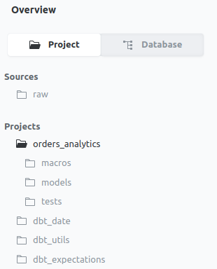
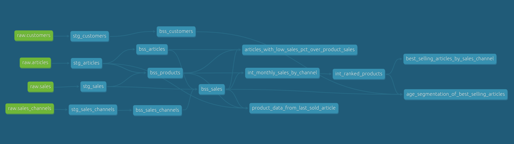
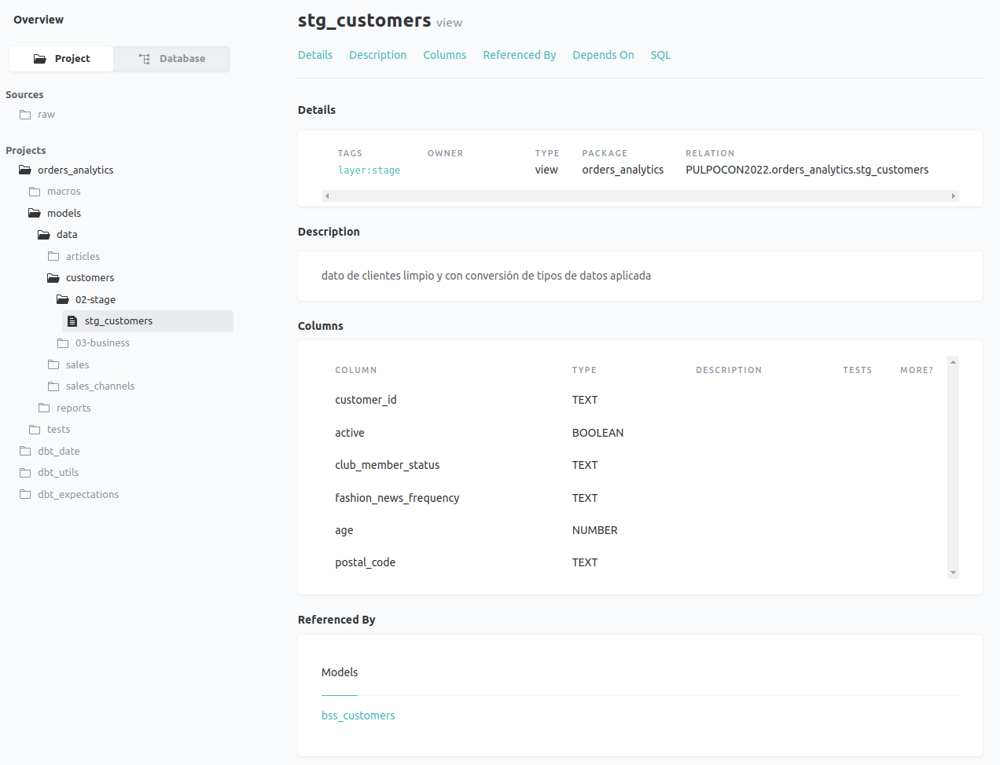
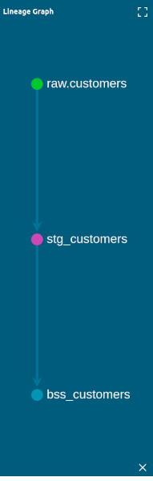

<!-- header -->
<h1 align="center">Pulpocon 2022 · Construyendo pipelines de datos a escala</h1>

 
    

        <a  href="../README.md" target="_top">inicio</a>
        &nbsp;&nbsp;·&nbsp;&nbsp;
        <a href="../01-procesando-en-capas/README.md" target="_top">anterior</a> / 
        <a href="../03-testeando-modelos/README.md" target="_top">siguiente</a>
    

    
&nbsp;

<!-- content -->
Esta sección requiere las modificaciones hechas en los apartados anteriores. Puedes partir de la rama `02-documentando-la-pipeline` del repositorio en caso de que no hayas podido completar alguna de ellas, eso sí, ten en cuenta lo siguiente: es imprescindible que hayas ejecutado previamente en algún momento las prácticas: [Conectando Snowflake y dbt](../00-introduccion-snowflake-dbt/README.md#octopusconectando-snowflake-y-dbt) y [Poblando de datos la capa raw](../01-procesando-en-capas/README.md#poblando-de-datos-la-capa-raw); puedes hacerlo ahora si lo necesitas. Además, ya que esta sección genera documentación a partir de modelos ya construidos, deberás ejecutar un comando `dbt run` si todavía no lo has hecho.

## Documentando la pipeline de transformación

Cuando tenemos una visión general completa de todos nuestros flujos de datos, fuentes, transformaciones y dependencias, podemos hablar de la precisión y la calidad de nuestros datos y tener confianza en la información y los informes de nuestros datos. 

El *lineage* de datos nos ayuda a controlar la complejidad de los datos brindandonos una descripción completa de cómo se mueven nuestros datos dentro de nuestra *pipeline*, dónde se originaron, cómo se transforman en el camino y cómo están interconectados. Por ello, el *lineage* de datos puede ayudarnos a garantizar la calidad de nuestros datos, aumentar la confianza en nuestros datos y acelerar los análisis de causa raíz e impacto.

Dbt utiliza toda la información de nuestro código para generar la documentación: fuentes de datos, modelos, dependencias, tests, código SQL “original” y “compilado”, e incluso gracias al conocimiento de estas interdependencias entre modelos, es capaz de construir el *lineage* de los datos. 
### :octopus: Generando la documentación del proyecto

Una vez tenemos nuestros modelos construidos y ejecutados con el comando `dbt run`, podemos generar la documentación y verla en nuestro navegador.

1.  ejecutamos los siguientes comandos:

~~~bash
dbt docs generate
dbt docs serve > logs/doc.log 2>&1 &
~~~

    *NOTA: lanzamos el comando dbt docs serve para que se ejecute
           en segundo plano y nos permita seguir trabajando en 
           la shell normalmente

Abrimos un navegador y copiamos la URL:  http://localhost:8080 y en seguida nos aparecerá, en el marco izquierdo de la ventana, una representación de nuestra estructura del proyecto, junto con las fuentes de datos `raw` y los paquetes de los que depende el proyecto:

<em>Fig - estructura de nuestro proyecto</em>

2.  accedemos al *lineage* completo, situándonos en la carpeta de nuestro proyecto y haciendo sobre click sobre el botón azul que aparece en la esquina inferior derecha de la ventana:

<em>Fig - lineage de datos de nuestro proyecto</em>

El *lineage* de datos se representa en forma de grafo acíclico dirigido (DAG). Cada nodo del grafo representa un modelo, y las aristas entre los nodos están definidos por las funciones de referencia, donde un modelo especificado en una función de referencia se reconoce como un predecesor de el modelo actual. 

Cuando se ejecuta dbt, los modelos se ejecutan en el orden especificado en el *lineage*; no es necesario definir explícitamente el orden de ejecución de sus modelos. Nos va a permitir tener una trazabilidad de las trasformaciones que se aplican a nuestros datos en todo el pipeline de ejecución, ofreciéndonos una representación más visual del procesamiento en capas que veíamos en la sección anterior.

3.  accedemos a la documentación de cualquier modelo, navegando por la estructura del proyecto. Una buena documentación de nuestros modelos ayudará a los consumidores intermedios a descubrir y comprender los conjuntos de datos que selecciona para ellos. 

Por ejemplo navegando al modelo `stg_customers`, podemos acceder a la descripción del mismo, al detalle de sus columnas, de qué modelos se nutre y por qué otros modelos es referenciado, y finalmente el código fuente y compilado de nuestro modelo. 

<em>Fig - documentación del modelo stg_customers</em>

Haciendo click sobre el botón azul que aparece en la esquina inferior derecha de la ventana, también podemos acceder a un "mini-mapa" del DAG de ese modelo.

<em>Fig - lineage del modelo stg_articles</em>

## Recapitulando...

Algunos puntos a destacar en lo que a la documentación de nuestra *pipeline* se refiere:

- generar una documentación de forma semi-automática nos ayuda a generar y publicar datos de forma confiable, así como a limitar el posible impacto de cualquier modificación sobre nuestra lógica
- extraer el *lineage* desde la propia definición de nuestros modelos nos ayuda a tener una visión *end-to-end* del procesos de transformación complejos
- el *lineage* y la documentación vinculada facilita drásticamente el consumo de nuestros datos por terceros y que lo hagan, además, en modo *self-service*

<!-- footer -->

&nbsp;

&nbsp;

 
    

        <a  href="../README.md" target="_top">inicio</a>
        &nbsp;&nbsp;·&nbsp;&nbsp;
        <a href="../01-procesando-en-capas/README.md" target="_top">anterior</a> / 
        <a href="../03-testeando-modelos/README.md" target="_top">siguiente</a>
    

    
&nbsp;

 
  
<strong>Pulpocon · 2022</strong> Construyendo pipelines de datos a escala

  
<code>rosa@nextail.co</code> <code>david.macia@nextail.co</code>

