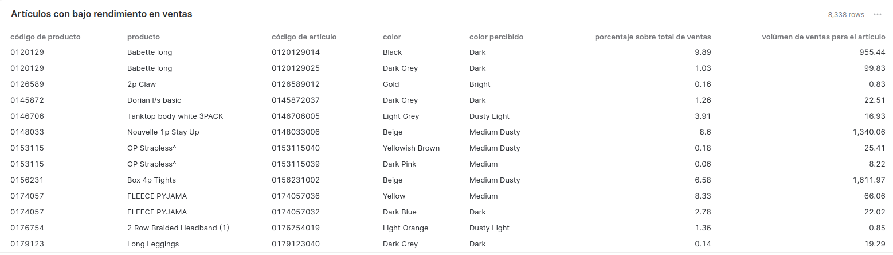
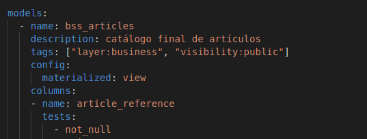
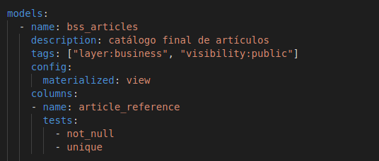
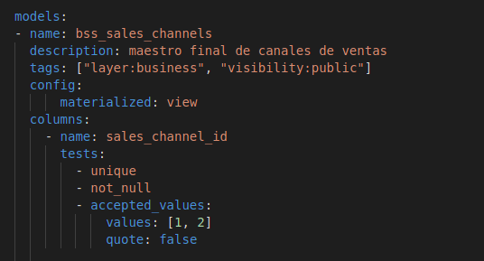
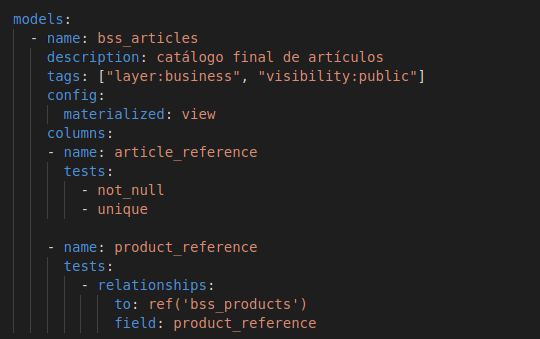
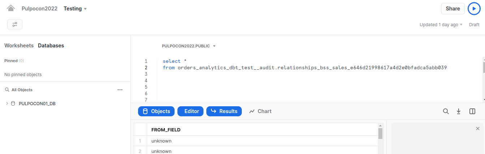
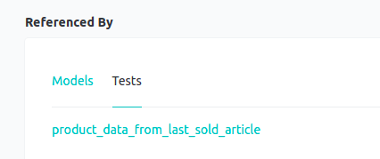
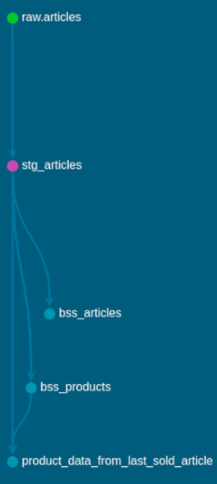
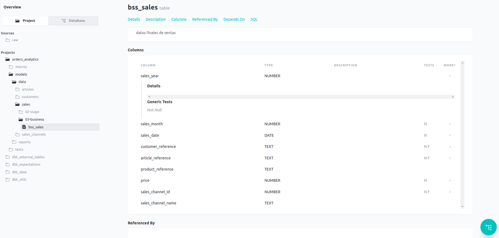

<!-- header -->
<h1 align="center">Pulpocon 2022 · Construyendo pipelines de datos a escala</h1>

 
    

        <a  href="../README.md" target="_top">inicio</a>
        &nbsp;&nbsp;·&nbsp;&nbsp;
        <a href="../02-documentando-la-pipeline/README.md" target="_top">anterior</a> / 
        <a href="../04-manejando-grandes-volumetrias/README.md" target="_top">siguiente</a>
    

    
&nbsp;

<!-- content -->

Esta sección requiere las modificaciones hechas en los apartados anteriores. Puedes partir de la rama `03-testeando-modelos` del repositorio en caso de que no hayas podido completar alguna de ellas, eso sí, ten en cuenta lo siguiente: es imprescindible que hayas ejecutado previamente en algún momento las prácticas: [Conectando Snowflake y dbt](../00-introduccion-snowflake-dbt/README.md#octopusconectando-snowflake-y-dbt) y [Poblando de datos la capa raw](../01-procesando-en-capas/README.md#poblando-de-datos-la-capa-raw); puedes hacerlo ahora si lo necesitas. Además, ya que esta sección añade tests a modelos ya construidos, deberás ejecutar un comando `dbt run` si todavía no lo has hecho.

## Añadiendo tests a los modelos

Las organizaciones orientadas a datos (*data-driven*) necesitan protegerse de los errores en los datos que puedan causar conclusiones incorrectas en los procesos de análisis y reporting posteriores. El código escrito para implementar procesos de análisis suele ser frágil, ya que los cambios en los datos subyacentes rompen la mayoría del código analítico de manera que son difíciles de predecir y corregir.

Construir una *pipeline* de datos a escala implica, sin lugar a dudas, aplicar una serie de buenas prácticas en lo que a la realización de tests de datos se refiere. Uno de los problemas más comunes es hacer suposiciones sobre la naturaleza de los datos devueltos por un modelo sin validar que dichas suposiciones se correspondan con el comportamiento real del modelo. En un escenario complejo, sería muy común tener, por ejemplo, un informe de ventas que es consumido por varios equipos diferentes y necesitamos garantizar que cada uno de esos consumidores obtiene el dato con la forma y contenido esperado, de modo que puedan tomar las decisiones de negocio adecuadas basadas en dato fiable. 

Nuestro proyecto dbt, alberga este tipo de informes en el directorio `dbt/orders_analytics/src/reports`. En él hemos construido un modelo
`articles_with_low_sales_pct_over_product_sales` que analiza las ventas de distintos productos para determinar cuáles de sus tallas o colores tienen menos éxito en el mercado.

Este informe se nutre de los modelos de nuestra capa *business* (`bss_sales`, `bss_products` y `bss_articles`) que, como hemos comentado en la sección anterior, exponen dato listo para ser consumido por terceros. Por lo tanto, debemos garantizar que la información que exponen estos modelos es confiable y estable en el tiempo.

<em>Fig - ejemplo de resultados del informe articles_with_low_sales_pct_over_product_sales</em>

Dbt nos ofrece diversas funcionalidades de *testing*, así que nos volveremos a apoyar en la librería para definir desde test básicos que validan el dato de un modelo concreto, hasta tests más avanzados que se ocupen de la lógica de negocio que involucra a varios modelos.

## Testeando datos de un modelo

Empezar con los tests más básicos significa comenzar con tests genéricos, que son tests modulares y reutilizables para garantizar la confiabilidad e integridad de los datos de un modelo. Dbt te ofrece algunos tests genéricos (también conocidas como *schema tests*) que vienen predefinidos y se pueden implementar con una configuración mínima. 

No es necesario implementar nada, tan sólo tienes que añadirlos de forma declarativa, es decir, no es necesario que yo escriba el test sino que lo añado como metainformación en el modelo existente (u otro recurso como source). Estas propiedades se incluyen en los archivos `.yml` en el mismo directorio que su recurso.

Vemos algunos ejemplos:

1. **not_null**: un valor nulo en los datos indica que falta un valor en una columna o se desconoce. A veces, los valores nulos son intencionales y deseados. Otras veces, son una indicación de un problema de datos. Este tipo de test identifica dónde existen valores nulos. Por ejemplo, verificamos que todos nuestros artículos no contienen valores nulos.

<em>Fig - test genérico not_null sobre columna article_reference en modelo bss_articles
</em>

2. **unique**: este tipo de test se utiliza para garantizar que no haya valores duplicados o filas recurrentes en un conjunto de datos. Esto es importante porque los valores duplicados en las columnas de datos, como las claves primarias, pueden generar métricas de datos engañosas, visualizaciones inexactas e informes poco confiables. 

Por ejemplo, si nuestros modelos `bss_articles` o `bss_products` fueran susceptibles de tener valores duplicados de *article_reference* o *product_reference*, esto tendría un impacto serio en nuestro informe. Si existieran valores duplicados, esto inflaría los números informados en nuestras ventas de artículos en un periodo porque cada fila en nuestro modelo `bss_sales` se duplicaría durante la unión de las tablas.

<em>Fig - test genérico unique sobre columna article_reference en modelo bss_articles
</em>

3. **accepted_values**: este tipo de test verifica que todos los valores de columna en todas las filas estén en el conjunto de valores válidos. Por ejemplo, nuestra columna *sales_channel_id* en nuestro modelo `bss_sales_channels` solo puede tener dos valores válidos (1, 2). Si este test descubre algún valor en la columna *sales_channel_id* que no sea uno de estos dos fallará.

<em>Fig - test genérico accepted_values sobre columna sales_channels_id en modelo bss_sales_channels
</em>

4. **relationships**: este tipo de test verifica la integridad referencial, asegurando que todos los registros en una tabla secundaria tengan un registro correspondiente en la tabla principal. Por ejemplo, verificamos que todos los valores de *product_reference* en nuestro modelo `bss_articles` existen en el modelo `bss_products`.

<em>Fig - test genérico relationships sobre columna product_reference en modelo bss_articles
</em>

A lo largo de los siguientes pasos iremos testeando nuestro modelo de ventas, podemos utilizar cualquier editor de texto para crear y editar los ficheros necesarios y, a la hora de ejecutar comandos dbt, lo haremos desde la shell.

 :octopus: <strong>Añadiendo tests genéricos en el modelo de ventas</strong>

Nuestro informe de ventas de artículos con un bajo rendimiento (`articles_with_low_sales_pct_over_product_sales`) del que hablamos al inicio de la sección, sin duda se vería afectado por valores *NULL* en la columna *product_reference*. Esto podría provocar que ciertos artículos no se tuviesen en cuenta en el análisis.

También sería un error de datos común que se registraran nuevas ventas en el modelo `bss_sales` con una referencia *article_reference* incorrecta, que no existiese en el catálogo de productos. Como resultado, el informe reportaría ventas inferiores a las reales. Esto pone de manifiesto lo importante que es realizar las comprobaciones de integridad referencial entre las distintas fuentes de datos.

Para testear estos casos de uso haremos lo siguiente:

1. editaremos el fichero `bss_sales.yml` dentro del directorio: `orders_analytics/src/model/data/sales/03-business` que contiene la metainformación asociada al modelo. En él añadiremos un test de `not_null` para realizar la validación sobre las siguientes columnas:

    - sales_date, sales_year, sales_month
    - price, sales_channel_id
    - customer_reference, article_reference, product_reference 
      
~~~yml
version: 2

models:
  - name: bss_sales
    description: datos finales de ventas
    config: 
      tags: ["layer:business", "visibility:public"]
      materialized: table

    columns:
    - name: sales_date
      tests:
        - not_null
    
    - name: sales_year
      tests:
        - not_null

    - name: sales_month
      tests:
        - not_null

    - name: price
      tests:
        - not_null

    - name: sales_channel_id
      tests:
        - not_null

    - name: customer_reference
      tests:
        - not_null

    - name: article_reference
      tests:
        - not_null

    - name: product_reference
      tests:
        - not_null
~~~

2. añadiremos también tests de tipo `relationships` a las siguientes columnas para validar su integridad referencial:
   
   - sales_channel_id --> bss_sales_channels
   - customer_reference --> bss_customers
   - article_reference --> bss_articles
   - product_reference --> bss_products
   
~~~yml
version: 2

models:
  - name: bss_sales
    description: datos finales de ventas
    config: 
      tags: ["layer:business", "visibility:public"]
      materialized: table

    columns:
    - name: sales_date
      tests:
        - not_null
    
    - name: sales_year
      tests:
        - not_null

    - name: sales_month
      tests:
        - not_null

    - name: price
      tests:
        - not_null

    - name: sales_channel_id
      tests:
        - not_null
        - relationships:                  # <--- nuevo test de integridad referencial
            to: ref('bss_sales_channels')
            field: sales_channel_id

    - name: customer_reference
      tests:
        - not_null
        - relationships:                 # <--- nuevo test de integridad referencial
            to: ref('bss_customers')
            field: customer_reference

    - name: article_reference
      tests:
        - not_null
        - relationships:                 # <--- nuevo test de integridad referencial
            to: ref('bss_articles')
            field: article_reference

    - name: product_reference
      tests:
        - not_null
        - relationships:                 # <--- nuevo test de integridad referencial
            to: ref('bss_products')
            field: product_reference
~~~

&nbsp;

 :octopus: <strong>Detectando dato sucio en el modelo de ventas</strong>

Una vez que hemos definido los tests y su metainformación para las capas business de ventas, podemos proceder a ejecutarlos en dbt y ver si nuestros datos pasan o no los tests.

1. para ello, desde la consola shell y dentro del directorio `orders_analytics/src` ejecutaremos:

~~~bash
dbt test --store-failures
~~~

Con este comando estaremos pidiendo a dbt que ejecute todos los tests de nuestra pipeline de transformación de datos y, además, que en el caso de encontrar algún problema nos almacene aquellas tuplas que no pasan un determinado test y las persista en un esquema especial (`orders_analytics_dbt_test__audit`) dentro de la base de datos.

*(se muestra a continuación solo parte de la salida del comando)*
~~~bash
Running with dbt=1.2.0
Found 14 models, 26 tests, 0 snapshots, 0 analyses, 715 macros, 0 operations, 0 seed files, 4 sources, 0 exposures, 0 metrics

Concurrency: 1 threads (target='snowflake')

[...]
4 of 26 START test not_null_bss_customers_age .................................. [RUN]
4 of 26 WARN 15861 not_null_bss_customers_age .................................. [WARN 15861 in 2.32s]
[...]
20 of 26 START test relationships_bss_sales_customer_reference__customer_reference__ref_bss_customers_  [RUN]
20 of 26 FAIL 23223 relationships_bss_sales_customer_reference__customer_reference__ref_bss_customers_  [FAIL 23223 in 4.69s]
[...]

Finished running 26 tests in 0 hours 0 minutes and 49.78 seconds (49.78s).

Completed with 1 error and 1 warning:

Failure in test relationships_bss_sales_customer_reference__customer_reference__ref_bss_customers_ (models/data/sales/03-business/bss_sales.yml)
  Got 23223 results, configured to fail if != 0

  compiled SQL at target/compiled/orders_analytics/models/data/sales/03-business/bss_sales.yml/relationships_bss_sales_e646d21998617a4d2e0bfadca5abb039.sql

  See test failures:
  --------------------------------------------------------------------------------------------------------------------
  select * from orders_analytics_dbt_test__audit.relationships_bss_sales_e646d21998617a4d2e0bfadca5abb039
  --------------------------------------------------------------------------------------------------------------------

Warning in test not_null_bss_customers_age (models/data/customers/03-business/bss_customers.yml)
  Got 15861 results, configured to warn if != 0

  compiled SQL at target/compiled/orders_analytics/models/data/customers/03-business/bss_customers.yml/not_null_bss_customers_age.sql

  See test failures:
  --------------------------------------------------------------------------------------
  select * from orders_analytics_dbt_test__audit.not_null_bss_customers_age
  --------------------------------------------------------------------------------------

Done. PASS=24 WARN=1 ERROR=1 SKIP=0 TOTAL=26
~~~

A la vista de los resultados, detectamos que tenemos un *warning* y un error en nuestros modelos:

- ***Warning** en el test `not_null_bss_customers_age`**: la columna `age` del modelo `bss_customers` contiene valores nulos.
- **Fallo en el test `relationships_bss_sales_customer_reference__customer_reference__ref_bss_customers_`**: algún valor de la columna `customer_reference` en el modelo `bss_sales` rompe la integridad referencial con el modelo `bss_customers`. 
  
Tal y como hemos visto, los tests además de detectar errores en los modelos nos pueden servir para tener una mejor observabilidad de nuestro proceso. Casos como el del campo `age` del modelo `bss_customers` no tienen la entidad suficiente como para ser considerado un error, pero sí puede disparar una alerta para una posible revisión de los datos de los clientes afectados. 

Por otro lado, el segundo de los errores, la rotura de la integridad referencial, sí supone un error importante y debemos investigar el origen del mismo. Para localizar las tuplas concretas que no pasan el test, podemos utilizar los datos volcados por dbt al esquema con sufijo `dbt_test__audit`:

2. ejecutaremos en Snowflake, desde cualquier `Worksheet` que hayamos creado, la consulta recuperada del log:

El resultado nos arroja luz sobre el valor de la columna `customer_reference` que no cumple la integridad referencial en el modelo `bss_sales`:

|FROM_FIELD |
|-----------|
|unknown    |
|unknown    |
|unknown    |
|unknown    |
|unknown    |

Observamos que todos los registros muestran el valor `unknown`, por lo tanto adaptaremos nuestros modelos para filtrar dicho valor incorrecto. Se pueden plantear varias soluciones, algunas más correctas que otras pensando en entornos productivos. De cara al taller y con fines didácticos vamos a optar por filtrar el dato de la forma más sencilla posible, añadiendo una condición en la etapa más temprana de nuestro procesado de ventas de forma que descartemos este dato sucio lo antes posible en nuestra *pipeline*.

3. editaremos el fichero `stg_sales.sql` dentro del directorio: `orders_analytics/src/model/data/sales/02-stage`:

~~~sql
--INPUT: raw input data
WITH raw_data AS (
    SELECT *
    FROM {{ source('raw','sales') }}
)

--OUTPUT: data cleaned and with casting applied
SELECT
    t_dat::DATE AS t_dat,
    customer_id,
    article_id,
    price::DECIMAL(11,2) AS price,
    sales_channel_id::INTEGER AS sales_channel_id
FROM
    raw_data
WHERE 
    customer_id <> 'unknown'
~~~

Una vez hecho estos cambios, reconstruiremos los modelos y volveremos a ejecutar nuestros tests para validar que, ahora sí, estos se comportan como esperamos.

Si reconstruimos los modelos y volvemos a lanzar los tests, comprobaremos que el error ya no se produce. En este caso utilizaremos una sintaxis especial de dbt para volver a construir solamente el modelo que hemos cambiado y todos sus dependientes:

4. ejecutamos los comandos `dbt run` y `dbt test`:
~~~
dbt run -s stg_sales+
dbt test
~~~

    *NOTA: usamos el `+` para indicar que deben recrearse también los
           modelos dependientes del que hemos corregido

~~~bash
Running with dbt=1.2.0
Found 14 models, 26 tests, 0 snapshots, 0 analyses, 715 macros, 0 operations, 0 seed files, 4 sources, 0 exposures, 0 metrics

Concurrency: 1 threads (target='snowflake')

1 of 26 START test accepted_values_bss_customers_active__True__False ........... [RUN]
1 of 26 PASS accepted_values_bss_customers_active__True__False ................. [PASS in 1.50s]
2 of 26 START test accepted_values_bss_sales_channels_sales_channel_id__False__1__2  [RUN]
2 of 26 PASS accepted_values_bss_sales_channels_sales_channel_id__False__1__2 .. [PASS in 1.00s]
3 of 26 START test not_null_bss_articles_article_reference ..................... [RUN]
3 of 26 PASS not_null_bss_articles_article_reference ........................... [PASS in 1.01s]
4 of 26 START test not_null_bss_customers_age .................................. [RUN]
4 of 26 WARN 15861 not_null_bss_customers_age .................................. [WARN 15861 in 0.88s]
5 of 26 START test not_null_bss_customers_customer_reference ................... [RUN]
5 of 26 PASS not_null_bss_customers_customer_reference ......................... [PASS in 0.82s]
6 of 26 START test not_null_bss_products_product_reference ..................... [RUN]
6 of 26 PASS not_null_bss_products_product_reference ........................... [PASS in 0.78s]
7 of 26 START test not_null_bss_sales_article_reference ........................ [RUN]
7 of 26 PASS not_null_bss_sales_article_reference .............................. [PASS in 0.93s]
8 of 26 START test not_null_bss_sales_channels_sales_channel_id ................ [RUN]
8 of 26 PASS not_null_bss_sales_channels_sales_channel_id ...................... [PASS in 0.77s]
9 of 26 START test not_null_bss_sales_channels_sales_channel_name .............. [RUN]
9 of 26 PASS not_null_bss_sales_channels_sales_channel_name .................... [PASS in 0.69s]
10 of 26 START test not_null_bss_sales_customer_reference ...................... [RUN]
10 of 26 PASS not_null_bss_sales_customer_reference ............................ [PASS in 0.71s]
11 of 26 START test not_null_bss_sales_price ................................... [RUN]
11 of 26 PASS not_null_bss_sales_price ......................................... [PASS in 0.77s]
12 of 26 START test not_null_bss_sales_product_reference ....................... [RUN]
12 of 26 PASS not_null_bss_sales_product_reference ............................. [PASS in 0.97s]
13 of 26 START test not_null_bss_sales_sales_channel_id ........................ [RUN]
13 of 26 PASS not_null_bss_sales_sales_channel_id .............................. [PASS in 1.54s]
14 of 26 START test not_null_bss_sales_sales_date .............................. [RUN]
14 of 26 PASS not_null_bss_sales_sales_date .................................... [PASS in 0.81s]
15 of 26 START test not_null_bss_sales_sales_month ............................. [RUN]
15 of 26 PASS not_null_bss_sales_sales_month ................................... [PASS in 1.23s]
16 of 26 START test not_null_bss_sales_sales_year .............................. [RUN]
16 of 26 PASS not_null_bss_sales_sales_year .................................... [PASS in 1.09s]
17 of 26 START test product_data_from_last_sold_article ........................ [RUN]
17 of 26 PASS product_data_from_last_sold_article .............................. [PASS in 5.83s]
18 of 26 START test relationships_bss_articles_product_reference__product_reference__ref_bss_products_  [RUN]
18 of 26 PASS relationships_bss_articles_product_reference__product_reference__ref_bss_products_  [PASS in 1.19s]
19 of 26 START test relationships_bss_sales_article_reference__article_reference__ref_bss_articles_  [RUN]
19 of 26 PASS relationships_bss_sales_article_reference__article_reference__ref_bss_articles_  [PASS in 1.51s]
20 of 26 START test relationships_bss_sales_customer_reference__customer_reference__ref_bss_customers_  [RUN]
20 of 26 PASS relationships_bss_sales_customer_reference__customer_reference__ref_bss_customers_  [PASS in 5.03s]
21 of 26 START test relationships_bss_sales_product_reference__product_reference__ref_bss_products_  [RUN]
21 of 26 PASS relationships_bss_sales_product_reference__product_reference__ref_bss_products_  [PASS in 1.46s]
22 of 26 START test relationships_bss_sales_sales_channel_id__sales_channel_id__ref_bss_sales_channels_  [RUN]
22 of 26 PASS relationships_bss_sales_sales_channel_id__sales_channel_id__ref_bss_sales_channels_  [PASS in 0.99s]
23 of 26 START test unique_bss_articles_article_reference ...................... [RUN]
23 of 26 PASS unique_bss_articles_article_reference ............................ [PASS in 0.74s]
24 of 26 START test unique_bss_customers_customer_reference .................... [RUN]
24 of 26 PASS unique_bss_customers_customer_reference .......................... [PASS in 1.29s]
25 of 26 START test unique_bss_products_product_reference ...................... [RUN]
25 of 26 PASS unique_bss_products_product_reference ............................ [PASS in 0.92s]
26 of 26 START test unique_bss_sales_channels_sales_channel_id ................. [RUN]
26 of 26 PASS unique_bss_sales_channels_sales_channel_id ....................... [PASS in 0.77s]

Finished running 26 tests in 0 hours 0 minutes and 36.79 seconds (36.79s).

Completed with 1 warning:

Warning in test not_null_bss_customers_age (models/data/customers/03-business/bss_customers.yml)
  Got 15861 results, configured to warn if != 0

  compiled SQL at target/compiled/orders_analytics/models/data/customers/03-business/bss_customers.yml/not_null_bss_customers_age.sql

Done. PASS=25 WARN=1 ERROR=0 SKIP=0 TOTAL=26

 ~~~

Ahora todos nuestros tests pasan las validaciones y podemos concluir que el comportamiento de los modelos es el esperado.

 

&nbsp;
   

## Testeando nuestros modelos como *contratos de datos*

Los modelos de nuestra capa business están etiquetados con el tag `visibility:public`. Esta especificación de visibilidad es la manera de exponer nuestros modelos para ser usados de forma similar a un API, estableciendo una especie de contrato con los potenciales consumidores del modelo en el que es importante garantizar que la estructura del dato ofrecido se mantenga estable y correcta a lo largo del tiempo. 

Dentro de dbt podemos utilizar el paquete `dbt-expectations`, que es una implementación de tests al estilo de  la librería [Great Expectations](https://greatexpectations.io/), directamente ejecutables sobre un repositorio de datos. El paquete incluye más de 50 tests que se usan comúnmente relacionados con:
- cambios en la estructura de los modelos: por ejemplo `expect_column_to_exist` o `expect_table_column_count_to_equal`
- patrones de búsqueda dentro de una cadena: por ejemplo `expect_column_values_to_match_regex`
- conjuntos y rangos de datos: por ejemplo `expect_column_values_to_be_between`
- funciones agregadas: por ejemplo `expect_column_sum_to_be_between`

Veremos ahora cómo utilizar esta librería para dotar a nuestro modelo `bss_sales` de tests que validen no solo sus datos, sino también su estructura.

 :octopus: <strong>Añadiendo tests de estructura en el modelo de ventas</strong>

Utilizaremos el test `expect_column_to_exist` del paquete `dbt_expectations` para validar que el modelo siempre devuelve las columnas esperadas, sea cual sea su implementación interna.

1. modificaremos el fichero `bss_sales.yml` para añadir el test de estructura a cada una sus columnas:

~~~yml
version: 2

models:
  - name: bss_sales
    description: datos finales de ventas
    config: 
      tags: ["layer:business", "visibility:public"]
      materialized: table

    columns:
    - name: sales_date
      tests:
        - not_null
        - dbt_expectations.expect_column_to_exist   # <--- nuevo test de estructura
    
    - name: sales_year
      tests:
        - not_null
        - dbt_expectations.expect_column_to_exist   # <--- nuevo test de estructura

    - name: sales_month
      tests:
        - not_null
        - dbt_expectations.expect_column_to_exist   # <--- nuevo test de estructura

    - name: price
      tests:
        - not_null
        - dbt_expectations.expect_column_to_exist   # <--- nuevo test de estructura

    - name: sales_channel_id
      tests:
        - not_null
        - dbt_expectations.expect_column_to_exist   # <--- nuevo test de estructura
        - relationships:
            to: ref('bss_sales_channels')
            field: sales_channel_id

    - name: sales_channel_name
      tests:
        - dbt_expectations.expect_column_to_exist   # <--- nuevo test de estructura

    - name: customer_reference
      tests:
        - not_null
        - dbt_expectations.expect_column_to_exist   # <--- nuevo test de estructura
        - relationships:
            to: ref('bss_customers')
            field: customer_reference

    - name: article_reference
      tests:
        - not_null
        - dbt_expectations.expect_column_to_exist   # <--- nuevo test de estructura
        - relationships:
            to: ref('bss_articles')
            field: article_reference

    - name: product_reference
      tests:
        - not_null
        - dbt_expectations.expect_column_to_exist   # <--- nuevo test de estructura
        - relationships:
            to: ref('bss_products')
            field: product_reference
~~~

2. ejecutaremos los tests de nuestro modelo `bss_sales` en concreto para validar que su materialización cumple con la estructura esperada:

~~~bash
dbt test -s bss_sales
~~~

~~~bash
Running with dbt=1.2.0
Found 14 models, 34 tests, 0 snapshots, 0 analyses, 715 macros, 0 operations, 0 seed files, 4 sources, 0 exposures, 0 metrics

Concurrency: 1 threads (target='snowflake')

1 of 21 START test dbt_expectations_expect_column_to_exist_bss_sales_article_reference  [RUN]
1 of 21 PASS dbt_expectations_expect_column_to_exist_bss_sales_article_reference  [PASS in 1.71s]
2 of 21 START test dbt_expectations_expect_column_to_exist_bss_sales_customer_reference  [RUN]
2 of 21 PASS dbt_expectations_expect_column_to_exist_bss_sales_customer_reference  [PASS in 1.22s]
3 of 21 START test dbt_expectations_expect_column_to_exist_bss_sales_price ..... [RUN]
3 of 21 PASS dbt_expectations_expect_column_to_exist_bss_sales_price ........... [PASS in 1.12s]
4 of 21 START test dbt_expectations_expect_column_to_exist_bss_sales_product_reference  [RUN]
4 of 21 PASS dbt_expectations_expect_column_to_exist_bss_sales_product_reference  [PASS in 0.80s]
5 of 21 START test dbt_expectations_expect_column_to_exist_bss_sales_sales_channel_id  [RUN]
5 of 21 PASS dbt_expectations_expect_column_to_exist_bss_sales_sales_channel_id  [PASS in 0.89s]
6 of 21 START test dbt_expectations_expect_column_to_exist_bss_sales_sales_date  [RUN]
6 of 21 PASS dbt_expectations_expect_column_to_exist_bss_sales_sales_date ...... [PASS in 1.15s]
7 of 21 START test dbt_expectations_expect_column_to_exist_bss_sales_sales_month  [RUN]
7 of 21 PASS dbt_expectations_expect_column_to_exist_bss_sales_sales_month ..... [PASS in 1.05s]
8 of 21 START test dbt_expectations_expect_column_to_exist_bss_sales_sales_year  [RUN]
8 of 21 PASS dbt_expectations_expect_column_to_exist_bss_sales_sales_year ...... [PASS in 0.98s]
[...]

Finished running 21 tests in 0 hours 0 minutes and 25.40 seconds (25.40s).

Completed successfully

Done. PASS=21 WARN=0 ERROR=0 SKIP=0 TOTAL=21
~~~

Los tests de estructura pasan correctamete, tal y como esperábamos, y validarán que futuros cambios en la definición del modelo sigan exponiendo a sus consumidores las mismas columnas que se exponen actualmente. Este es un ejemplo sencillo de test de contrato a modo didáctico, pero sin duda un caso real de producción requeriría añadir tests más complejos que validasen también el tipo de los datos expuestos por el modelo y su formato.

&nbsp;

##  Testeando lógica de negocio compleja

Hasta ahora hemos testeado los datos y estructura de modelos individuales, pero es importante también tener la capacidad de testear lógicas de negocio más complejas, o casuísticas muy específicas de nuestros datos. Por ejemplo, dentro de nuestro proyecto los productos han ido sufriendo cambios en sus nombres y descripciones durante el historial de ventas: 

|PRODUCT_CODE|ARTICLE_ID|PROD_NAME                |
|------------|----------|-------------------------|
|0188183     |0188183001|Spanx alot shape Swimsuit|
|0188183     |0188183008|SPANX ALOT swimsuit (1)  |
|0188183     |0188183015|Spanx alot Swimsuit      |

<em>Tabla - cambios de el catálogo de productos durante el historial de ventas</em>

Como criterio de negocio se establece que nos debemos quedar con la información más actualizada y, por lo tanto, necesitamos garantizar que nuestro modelo de productos expone siempre los datos de su artículo más recientemente vendido.

Para asegurarnos de que nuestro catálogo de productos cumple con estas premisas, necesitamos crear un test complejo que involucre a más de un modelo: debe cruzar datos del modelo de productos (`bss_products`), la información de artículos vinculados (`stg_articles`) y el historial de ventas (`bss_sales`), para realizar las comprobaciones adecuadas.

Dbt nos ofrece la funcionalidad de *test singular* para definir, nuevamente, este tipo de validaciones como simples sentencias SELECT. Estas sentencias buscarán localizar registros fallidos, registros que probarían que el comportamiento de los modelos no es el esperado. Se trata de tests que, al igual que los anteriores sobre datos o estructura, hacemos a posteriori, una vez construidos nuestros modelos, y como parte o durante la ejecución de nuestra pipeline.

En nuestro proyecto encontramos un ejemplo de este tipo de tests en el archivo `product_data_from_last_sold_article.sql` del directorio `dbt/orders_analytics/src/tests/data/articles` que implementa las comprobaciones sobre los nombres de los productos comentadas anteriormente.

## Tests como parte de la documentación

Por último, es vital crear una buena documentación para nuestros tests de datos para que las futuras partes interesadas, como los analistas de datos o los ingenieros de software, puedan comprender fácilmente su propósito y ampliarlos cuando corresponda. La documentación proporciona una plantilla clara que otros pueden usar y ayuda a las partes interesadas a ser autónomas.

La documentación debe proporcionar el propósito del test y el contexto u orientación con respecto a por qué un test fallaría. Como vimos en la sección anterior, dbt puede autogenerar documentación con información sobre nuestro proyecto.

 :octopus: <strong>Visualizando la documentación de los test del proyecto</strong>

Cuando añadimos tests a los modelos, estos pasan a formar parte de la documentación de los modelos que nos entrega dbt.

1.  ejecutamos los siguientes comandos para regenerar la documentación tras la introducción de los tests:

~~~bash
dbt docs generate
~~~

    *NOTA: no es necesario ejecutar el comando 'docs serve'
           ya que la web de documentación la hemos arrancado en
           la sección anterior y ahora debe ser suficiente con 
           refrescar la página. En todo caso, si esta hubiese sido
           cerrada la podemos volver a lanzar ejecutando:

           dbt docs serve > logs/doc.log 2>&1 &

Refrescamos el navegador en la URL: http://localhost:8080

2.  navegamos hasta el modelo `stg_articles` y visualizamos como los tests singulares se reflejan en la documentación y en el *lineage*: 

<em>Fig - documentación de los tests singulares asociados al modelo stg_artcles 
</em>

<em>Fig - DAG del modelo stg_artcles donde se representa que es referenciado por el test singular product_data-from_last_sold_article
</em>

3.  navegamos hasta el modelo `bss_sales` y visualizamos como los tests genéricos se reflejan en las columnas del modelo:

<em>Fig - documentación de los schema tests asociados al modelo bss_sales 
</em>

&nbsp;
 

## Recapitulando...

Tanto los tests de validación de datos, de estructura o de lógicas de negocio complejas tienen una naturaleza ligeramente diferente a la de los tests unitarios a los que estamos habituados en el desarrollo de software, donde simulamos escenarios a priori y evaluamos el comportamiento de nuestro código afirmando que ciertas condiciones son correctas o verdaderas. En los tests de datos, sin embargo, estamos realizando validaciones a posteriori que se evalúan sobre la información real que procesa nuestra pipeline. Ambos tipos de test son importantes y, específicamente, los tests orientados a datos resultan imprescindibles para conseguir:

- detectar problemas o desviaciones lo antes posible, realizando una auditoria continua sobre los datos ingestados
- medir proactivamente cómo de correcto es el dato que estamos generando y cómo de saludable es la pipeline de transformación que estamos ejecutando
- en definitiva, mejorar la observabilidad de nuestro proceso de transformación de información

<!-- footer -->

&nbsp;

&nbsp;

 
    

        <a  href="../README.md" target="_top">inicio</a>
        &nbsp;&nbsp;·&nbsp;&nbsp;
        <a href="../02-documentando-la-pipeline/README.md" target="_top">anterior</a> / 
        <a href="../04-manejando-grandes-volumetrias/README.md" target="_top">siguiente</a>
    

    
&nbsp;

 
  
<strong>Pulpocon · 2022</strong> Construyendo pipelines de datos a escala

  
<code>rosa@nextail.co</code> <code>david.macia@nextail.co</code>

