<!-- header -->
<h1 align="center">Pulpocon 2022 · Construyendo pipelines de datos a escala</h1>

 
    

        <a  href="../README.md" target="_top">inicio</a>
        &nbsp;&nbsp;·&nbsp;&nbsp;
        <a href="../03-testeando-modelos/README.md" target="_top">anterior</a> / 
        <a href="../05-desarrollando-orientados-a-tests/README.md" target="_top">siguiente</a>
    

    
&nbsp;

<!-- content -->

Esta sección requiere las modificaciones hechas en los apartados anteriores. Puedes partir de la rama `04-manejando-grandes-volumetrias` del repositorio en caso de que no hayas podido completar alguna de ellas, eso sí, ten en cuenta lo siguiente: es imprescindible que hayas ejecutado previamente en algún momento las prácticas: [Conectando Snowflake y dbt](../00-introduccion-snowflake-dbt/README.md#octopusconectando-snowflake-y-dbt) y [Poblando de datos la capa raw](../01-procesando-en-capas/README.md#poblando-de-datos-la-capa-raw); puedes hacerlo ahora si lo necesitas.
## Estrategias ante grandes volumetrías de datos

Cuando nos enfrentamos a grandes volumetrías de datos existen múltiples factores que debemos tener en cuenta y que impactan decisivamente en el rendimiento de nuestra *pipeline*. Algunos de ellos serían:

- las características mismas de los datos, que condicionarán cómo pueden ser explotados
- el formato físico en el que hemos persistido la información, que será decisivo a la hora de acceder a ella de forma eficiente
- la posibilidad, o no, de procesar el dato en memoria en función de las limitaciones de nuestro sistema
- la capacidad que tengamos de procesar en paralelo y/o de forma distribuida
  
No resulta en absoluto sencillo gestionar estas complejidades tecnológicas. En escenarios sencillos podemos optar por cargar todo nuestro dato en memoria y procesarlo *in-situ*, de forma eficiente y utilizando una única instancia de cómputo; o, incluso, podríamos llegar a particionar nuestro dato y hacer el mismo procesado en memoria de forma concurrente. A medida que se complican los escenarios el salto de rendimiento suele ir asociado a la capacidad que tengamos de distribuir el cómputo entre varias máquinas, pero entonces tenemos que enfrentarnos a cuestiones como: coordinar un proceso distribuido, mezclar los resultados intermedios para construir nuestro dato final y garantizar la corrección del mismo, gestionar cachés y desbordamiento a disco cuando el dato a procesar exceda el tamaño de nuestra memoria, etc. etc.

En los últimos años, la tendencia clara de la industria ha sido el apostar por soluciones de procesamiento distribuido, apoyándose en el auge de las tecnologías *cloud* y los entornos basados en contenedores o virtualización. Además, todas estas soluciones no requieren de un *hardware* específico para su utilización (salvo casos muy puntuales como puede ser el procesamiento analítico sobre GPUs), pueden ser ejecutadas de forma eficiente en máquinas de propósito general y ofrecen a los desarrolladores interfaces y APIs de uso sencillas y políglotas. No obstante, independientemente del tipo de base tecnológica seleccionada para lidiar con escenarios de grandes volumetrías y a pesar de las simplificaciones en su uso que cada vez son más comunes, sigue siendo necesario tener presente ciertas buenas prácticas o estrategias para poder construir sobre ellas *pipelines* de datos que sean no solo eficientes, sino también económicas.

### Multithreading y procesamiento en paralelo

Cuando discutimos sobre cómo distribuir en capas nuestro procesado y las ventajas que esto nos aporta a nivel de mantenibilidad y flexibilidad, estábamos dando también los primeros pasos importantes a la hora de poder ejecutar nuestras transformaciones de forma eficiente. Construyendo un procesamiento en capas y manteniendo un *lineage* que establezca las dependencias existentes entre ellas, estamos posibilitando la ejecución en paralelo de nuestra *pipeline* de datos.

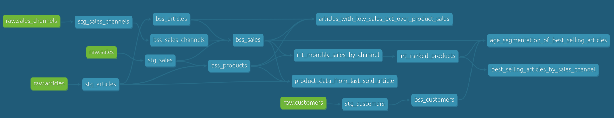

<em>Fig - lineage entre capas</em>

En el caso de dbt, la propia herramienta se encarga de explotar la información del *lineage* para, a partir de ella, construir en tiempo de ejecución un *DAG (Directed acyclic graph)* que sirva como plan de ejecución del proceso. Probaremos ahora cómo podemos aprovecharnos de ello para procesar en paralelo la ejecución de nuestra pipeline.

 :octopus: <strong>Ejecución usando varios hilos</strong>

1. desde nuestra *shell*, y dentro del directorio `orders_analytics/src`, ejecutaremos un comando `dbt run`. Comprobaremos cómo todos los pasos son ejecutados de forma secuencial y observaremos el tiempo final de ejecución:

~~~bash
dbt run
~~~

~~~bash
Running with dbt=1.2.0
Found 14 models, 34 tests, 0 snapshots, 0 analyses, 715 macros, 0 operations, 0 seed files, 4 sources, 0 exposures, 0 metrics

Concurrency: 1 threads (target='snowflake')

1 of 12 START view model orders_analytics.stg_articles ......................... [RUN]
1 of 12 OK created view model orders_analytics.stg_articles .................... [SUCCESS 1 in 2.79s]
2 of 12 START view model orders_analytics.stg_customers ........................ [RUN]
2 of 12 OK created view model orders_analytics.stg_customers ................... [SUCCESS 1 in 1.10s]
[...]
12 of 12 START table model orders_analytics.best_selling_articles_by_sales_channel  [RUN]
12 of 12 OK created table model orders_analytics.best_selling_articles_by_sales_channel  [SUCCESS 1 in 3.50s]

Finished running 4 view models, 8 table models in 0 hours 1 minutes and 11.66 seconds (71.66s).

Completed successfully
~~~

2. a continuación volveremos a ejecutar el proyecto, pero esta vez aumentando en nivel máximo de paralelismo a 4 mediante el flag: `--threads` que dbt nos ofrece:

~~~bash
dbt run --threads 4
~~~

~~~bash
Running with dbt=1.2.0
Found 14 models, 34 tests, 0 snapshots, 0 analyses, 715 macros, 0 operations, 0 seed files, 4 sources, 0 exposures, 0 metrics

Concurrency: 4 threads (target='snowflake')

1 of 12 START view model orders_analytics.stg_articles ......................... [RUN]
2 of 12 START view model orders_analytics.stg_customers ........................ [RUN]
3 of 12 START view model orders_analytics.stg_sales ............................ [RUN]
4 of 12 START view model orders_analytics.stg_sales_channels ................... [RUN]
4 of 12 OK created view model orders_analytics.stg_sales_channels .............. [SUCCESS 1 in 1.25s]
5 of 12 START table model orders_analytics.bss_sales_channels .................. [RUN]
1 of 12 OK created view model orders_analytics.stg_articles .................... [SUCCESS 1 in 1.50s]
6 of 12 START table model orders_analytics.bss_articles ........................ [RUN]
2 of 12 OK created view model orders_analytics.stg_customers ................... [SUCCESS 1 in 1.61s]
7 of 12 START table model orders_analytics.bss_customers ....................... [RUN]
3 of 12 OK created view model orders_analytics.stg_sales ....................... [SUCCESS 1 in 1.65s]
8 of 12 START table model orders_analytics.bss_products ........................ [RUN]
5 of 12 OK created table model orders_analytics.bss_sales_channels ............. [SUCCESS 1 in 1.98s]
6 of 12 OK created table model orders_analytics.bss_articles ................... [SUCCESS 1 in 3.02s]
9 of 12 START table model orders_analytics.bss_sales ........................... [RUN]
7 of 12 OK created table model orders_analytics.bss_customers .................. [SUCCESS 1 in 6.47s]
8 of 12 OK created table model orders_analytics.bss_products ................... [SUCCESS 1 in 13.59s]
9 of 12 OK created table model orders_analytics.bss_sales ...................... [SUCCESS 1 in 29.77s]
10 of 12 START table model orders_analytics.articles_with_low_sales_pct_over_product_sales  [RUN]
11 of 12 START table model orders_analytics.age_segmentation_of_best_selling_articles  [RUN]
12 of 12 START table model orders_analytics.best_selling_articles_by_sales_channel  [RUN]
10 of 12 OK created table model orders_analytics.articles_with_low_sales_pct_over_product_sales  [SUCCESS 1 in 3.34s]
12 of 12 OK created table model orders_analytics.best_selling_articles_by_sales_channel  [SUCCESS 1 in 5.12s]
11 of 12 OK created table model orders_analytics.age_segmentation_of_best_selling_articles  [SUCCESS 1 in 9.53s]

Finished running 4 view models, 8 table models in 0 hours 0 minutes and 46.21 seconds (46.21s).

Completed successfully

Done. PASS=12 WARN=0 ERROR=0 SKIP=0 TOTAL=12
~~~

Observaremos cómo el plan de ejecución ha cambiado y, apoyándose en las dependencias entre nuestras diversas capas, dbt es capaz de ejecutar en paralelo distintos modelos, logrando una importante reducción en el tiempo de procesado sin que ello haya supuesto ningún cambio ni en nuestro código fuente, ni en el entorno sobre el que lo hemos ejecutado. Tal y como hemos remarcado en otras ocasiones, cuando podemos diseñar nuestra *pipeline* de forma declarativa, separando la definición lógica de los detalles concretos de ejecución y estableciendo diversas capas, alcanzamos un nivel extra de flexibilidad que también nos ayuda en términos de rendimiento ante escenarios complejos.

Podríamos seguir aumentando el nivel máximo de paralelismo, pero rápidamente alcanzaríamos un límite en el que mayores niveles no suponen una mejora de rendimiento. Esto vendrá dado porque, o bien no es posible paralelizar más la ejecución de nuestros modelos debido a las dependencias existentes entre ellos, o bien nuestro entorno de ejecución no tiene recursos suficientes para procesar de forma concurrente nuestras solicitudes y debe empezar a encolar trabajos. Es por esto que aumentar el nivel de paralelismo es una herramienta potente, pero no la única de las estretegias que debemos tener en cuenta cuando pensamos en optimización.

### Desnormalización y persistencia de dato intermedio

Cuando trabajamos sobre grandes volúmenes de datos los cruces de información pueden llegar a ser muy costosos de computar. Es por ello que, en muchas ocasiones, nos interesa almecenar copias del mismo dato en diversos modelos para lograr un acceso de lectura más eficiente.

A esta estrategia se le conoce como "desnormalización de dato", en contrapunto al proceso común de "normalización" que cualquier sistema relacional aconseja par reducir la redundancia y los errores. La estrategia de "desnormalización" es clave cuando trabajamos contra sistemas *OLAP (Online Analytical Processing)*, ya que estos presentan unas características totalmente diferentes a los sitemas *OLTP (Online Transaction Processing)* tradicionales:

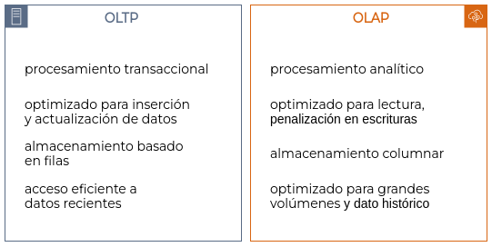

<em>Fig - Sistemas OLTP vs OLAP</em>

Desnormalizando el dato, es decir, teniendo diversas copias de la misma información precalculadas que podamos utilizar para reducir la cantidad de cruces de información que hacemos durante nuestra *pipeline*, conseguiremos mejoras en los tiempos de cómputo sin incurrir en costes importantes. Esto es debido a la diferencia existente entre aumentar costes por almacenamiento vs capacidad de cómputo; el almacenamiento es significativamente más económico y fácil de escalar.

Ahondando en el mismo concepto, cuando nos enfrentamos a cómputos complejos que se repiten en diferentes partes de nuestra *pipeline*, poder extraer esas transformaciones a modelos individuales y materializar físicamente los resultados, a modo de capa intermedia, para que estén disponibles en pasos posteriores es una estrategia común que, nuevamente, saca partido del bajo coste de almacenamiento para facilitar y optimizar las transformaciones en capas posteriores.

En nuestro caso particular, toda la configuración de tests automáticos sobre los datos y la estructura de nuestros modelos que hemos ido desarrollado en secciones anteriores nos permite realizar este proceso de desnormalización y generación de dato intermedio de forma segura, validando en todo momento la calidad de la información generada.

 :octopus: <strong>Materialización de dato intermedio reutilizable</strong>

En nuestro proyecto existen unos informes: `best_selling_articles_by_sales_channel` y `age_segmentation_of_best_selling_articles` que recuperan datos de un modelo intermedio `int_ranked_products` que calcula un ranking de productos y, para ello, cruza las dos fuentes de datos más costosas de nuestro caso de uso: ventas y catálogo de productos.

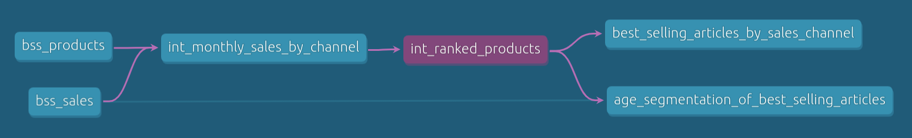

En este momento, ese modelo intermedio no está siendo materializado en la base de datos. Simplemente existe como si de un trozo de código reutilizable se tratase, los dos informes emplean su lógica para realizar el cómputo, pero ambos la ejecutan por separado y en tiempo de consulta. Esto lo podemos comprobar chequeando el plan de ejecución de uno de esos informes en Snowflake:

1. en nuestra shell, y dentro del directorio `orders_analytics/src`, ejecutaremos el siguiente comando para constuir uno de los dos informes a revisar:

~~~bash
dbt run -s best_selling_articles_by_sales_channel
~~~

~~~bash
Running with dbt=1.2.0
Found 14 models, 34 tests, 0 snapshots, 0 analyses, 715 macros, 0 operations, 0 seed files, 4 sources, 0 exposures, 0 metrics

Concurrency: 1 threads (target='snowflake')

1 of 1 START table model orders_analytics.best_selling_articles_by_sales_channel  [RUN]
1 of 1 OK created table model orders_analytics.best_selling_articles_by_sales_channel  [SUCCESS 1 in 5.35s]

Finished running 1 table model in 0 hours 0 minutes and 7.39 seconds (7.39s).

Completed successfully
~~~

2. entraremos ahora en la sección `Activity -> Query History` de Snowflake. En ella, mostraremos la columna "Query Tag" y la utilizaremos para localizar la query que ha construido nuestro modelo `best_selling_articles_by_sales_channel`. Una vez localizado, pulsaremos sobre la consulta para ver sus detalles de ejecución:

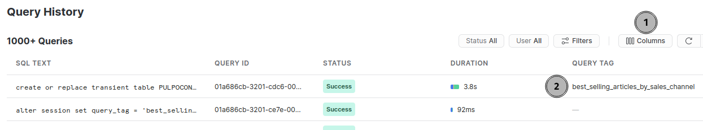

3. en los detalles de la ejecución accederemos al `Query Profile` y, dentro de él, al `Step 2` del proceso para observar el plan de ejecución completo de la consulta:

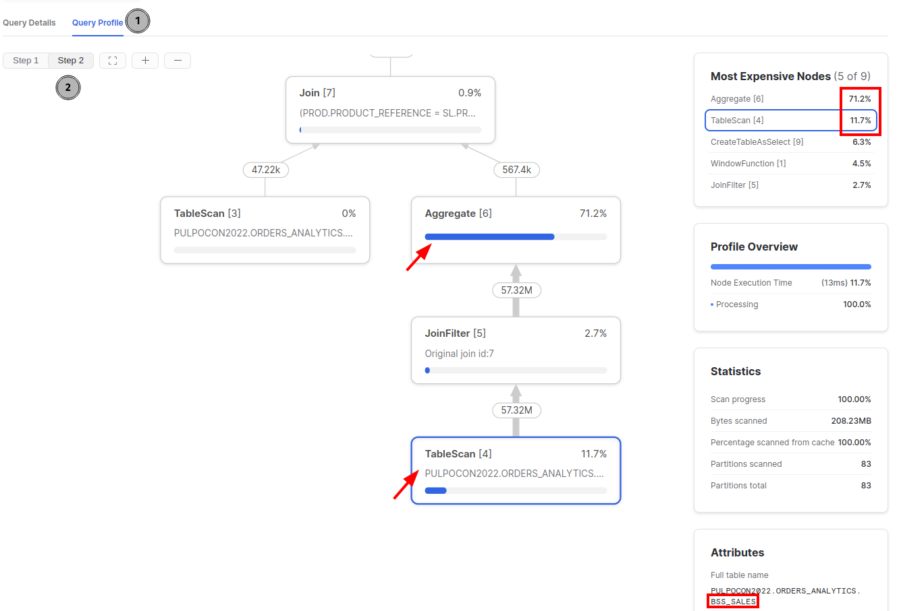

Podemos ver que más del 80% del tiempo de ejecución del modelo se emplea en escanear y agrupar datos de nuestr modelo `bss_sales`. Modelo al que, si revisamos de nuevo el gráfico de *lineage*, el informe no está directamente vinculado. Existen dos pasos intermedios en nuestra *pipeline* pero, tal y como hemos comentado, son pasos que no están siendo materializados en la persistencia, por lo que deben ser ejecutados cada vez que construimos un modelo que dependa de ellos.

Cambiemos ahora la configuración de uno de estos modelos intermedios para forzar que sea materializado como una tabla y observemos cómo afecta al plan de ejecución y a los tiempos de cómputo de nuestro informe. Con esto estaremos incurriendo en costes extra de almacenamiento (persistiremos una copia del dato que antes se calculaba de forma dinámica en tiempo de consulta), pero esperamos conseguir con ello una mejora significativa en el rendimiento.

4. editaremos el fichero `int_ranked_products.yml` de la carpeta `orders_analytics/src/models/reports/intermediate/`. En él se define la metainformación del modelo intermedio que queremos materializar y para ello fijaremos su tipo de materialización a `table`:

~~~yml
version: 2

models:

- name: int_ranked_products
  description: "CTE: ranking de productos según ventas mensuales"
  config: 
      tags: ["layer:report"]
      materialized: table
~~~

5. desde nuestra shell, y manteniéndonos siempre en el directorio `orders_analytics/src`, ejecutaremos el siguiente comando de dbt para forzar la regeneración del modelo recién cambiado y de todos los que dependen de él:

~~~bash
dbt run -s int_ranked_products+
~~~

    *NOTA: al añadir un `+` al comando dbt, estamos indicando que se ejecute el modelo concreto
           al que hacemos referencia y todos sus sucesores. 
           Nuevamente el lineage nos ayuda a ganar flexibilidad en tiempo de ejecución.

~~~bash
Running with dbt=1.2.0
Found 14 models, 34 tests, 0 snapshots, 0 analyses, 715 macros, 0 operations, 0 seed files, 4 sources, 0 exposures, 0 metrics

Concurrency: 1 threads (target='snowflake')

1 of 3 START table model orders_analytics.int_ranked_products .................. [RUN]
1 of 3 OK created table model orders_analytics.int_ranked_products ............. [SUCCESS 1 in 4.73s]
2 of 3 START table model orders_analytics.age_segmentation_of_best_selling_articles  [RUN]
2 of 3 OK created table model orders_analytics.age_segmentation_of_best_selling_articles  [SUCCESS 1 in 9.37s]
3 of 3 START table model orders_analytics.best_selling_articles_by_sales_channel  [RUN]
3 of 3 OK created table model orders_analytics.best_selling_articles_by_sales_channel  [SUCCESS 1 in 2.02s]

Finished running 3 table models in 0 hours 0 minutes and 18.42 seconds (18.42s).

Completed successfully

Done. PASS=3 WARN=0 ERROR=0 SKIP=0 TOTAL=3
~~~
 

6. finalmente, accedamos de nuevo a la vista de `Activity -> Query History` de Snowflake para observar cómo ha variado el plan de ejecución de nuestro modelo `best_selling_articles_by_sales_channel`. Debemos asegurarnos de haber refrescado los resultados que nos muestra la vista de histórico y filtrar de nuevo utilizando la columna "Query Tag":

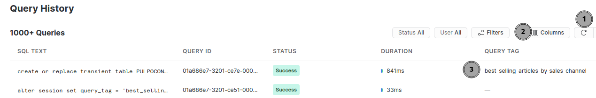

En los detalles de ejecución podemos observar como el único acceso se hace ahora sobre la tabla intermedia con el dato precalculado, de forma que nuestro informe y cualquier otro que deriven del mismo dato verán reducidos drásticamente sus tiempos de cómputo:

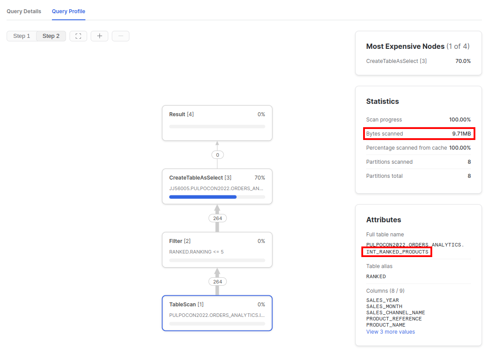

### Clusterización y escalabilidad

Definimos el concepto de **escalabilidad** como la capacidad de un sistema de procesamiento para aumentar su potencia de cómputo, tanto *verticalmente*, utilizando mejores máquinas, más CPU o RAM; como *horizontalmente*, cuando añadimos nuevos nodos a nuestro sistema que permitan distribuir la carga. Por su parte, desde el punto de vista de los datos llamaremos **clusterización** al proceso encargado de clasificar la información en el momento de su persistencia para determinar cómo esta debe ser almacenada físicamente. 

Usaremos como referenciala arquitectura de Snowflake para discutir sobre estos dos conceptos y cómo los podemos utilizar para incrementar el rendimiento de nuestras transformaciones. 

Comentábamos al inicio del taller que Snowflake establece una separación entre las capas de persistencia y cómputo, de modo que puede escalar cualquiera de ellas de forma independiente, esto es: podemos añadir mayor capacidad de almacenaje cuando lo necesitamos, pero también podemos aumentar la potencia de los nodos sobre los que ejecutamos nuestras transformaciones a demanda.

<em>Fig - Arquitectura de alto nivel en Snowflake</em>

En tiempo de ejecución, el dato se extrae desde la capa de persistencia y se distribuye entre los distintos nodos que realizarán el cómputo. Estos nodos forman parte de lo que se conoce como *virtual warehouse*, que tendrá una cantidad de nodos diferentes y con distintas características según la configuración que hayamos seleccionado. Es decir, la capa de cómputo se establece y configura de forma dinámica para cada una de nuestras ejecuciones. Esto, por supuesto, tiene un coste asociado en forma de latencia: el dato necesita ser trasladado a nuestro *virtual warehouse* para poder ser procesado, pero Snowflake utiliza una gestión interna de cachés y metadata para minimizar este impacto.

Físicamente, el dato en Snowflake se almacena en forma de *micro-particiones* que el sistema gestiona de forma automática. Una *micro-partición* es un bloque de información, entre 50Mb y 500Mb de dato descomprimido, unos 16MB de dato compactado en Snowflake, que se persiste de forma contigua y donde se almacenan una serie de filas completas. Estos datos se persisten en un formato columnar y, además, sobre ellos Snowflake calcula una serie de metainformación que será empleada para optimizar posteriores consultas: valores máximos y mínimos, rangos de datos, cantidad de valores distintos en cada columna, etc.

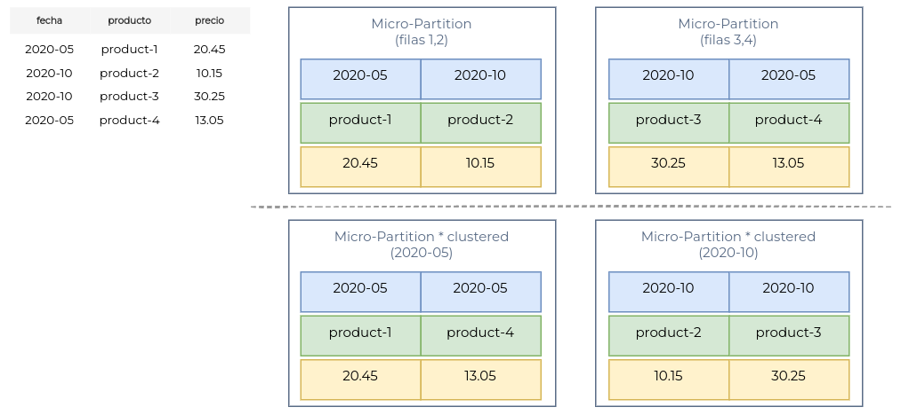

<em>Fig - Micro-particiones y clustering de datos en Snowflake</em>

El concepto de *micro-particiones* en Snowflake presenta una serie de características importantes que nos servirán para entender cómo es el funcionamiento típico de sistemas *MPP* (*massively parallel processing*):

- las particiones, aunque utilizan formato columnar, almacenan siempre filas completas de información. Una única partición es suficiente para recuperar todos los valores de una misma fila.
- las particiones se almacenan siempre de forma comprimida. El formato columnar permite tasas de compresión muy elevadas que permiten optimizar tanto persistencia como cómputo.
- las particiones son inmutables. Una actualización de datos genera una nueva partición que sustituirá a la previamente existente, como si de una nueva versión se tratase.
- las particiones se crean automáticamente en función del orden de inserción o carga de datos. Sin embargo, es posible definir una clave (simple o múltiple) de *clusterización*, de forma que sean organizadas en función de los valores de estas claves e independientemente del instante de inserción de los datos.

Este último punto, la posibilidad de *clusterizar* los datos para forzar una organización de *micro-particiones* concreta, posibilita adaptar la persistencia del dato al patrón de consumo más común que hagamos sobre él a lo largo de nuestra *pipeline* de datos. Experimentaremos, a continuación, cómo nos podemos apoyar en los conceptos de clusterizado y capacidades de escalado de un sistema flexible como Snowflake para optimizar nuestros procesos de análisis de datos.

 :octopus: <strong>Clusterizando nuestros datos de ventas</strong>

Vamos a analizar la ejecución del informe `articles_with_low_sales_pct_over_product_sales`. Este informe recupera datos de artículos con un bajo porcentaje de ventas, pero lo hace analizando únicamente una serie de meses determinados, no todo el histórico de ventas. Si observamos su definición (`articles_with_low_sales_pct_over_product_sales.sql`) podemos ver cómo los datos de ventas son filtrados por su fecha:

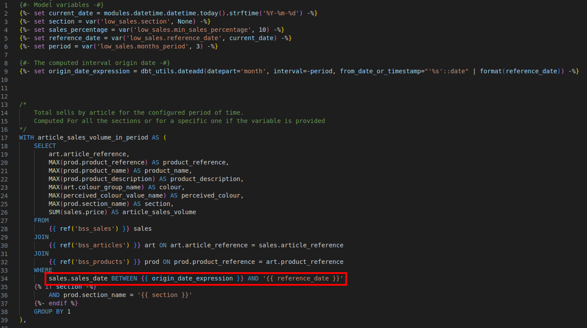

Comprobemos cómo se está comportando este filtro durante la ejecución en Snowflake y cómo podemos optimizar nuestro procesado haciendo uso de la clusterización de nuestros datos de ventas.

1. en nuestra shell, y dentro del directorio `orders_analytics/src`, ejecutaremos el siguiente comando para constuir el informe `articles_with_low_sales_pct_over_product_sales`:

~~~bash
dbt run -s articles_with_low_sales_pct_over_product_sales
~~~

~~~bash
Running with dbt=1.2.0
Found 14 models, 34 tests, 0 snapshots, 0 analyses, 715 macros, 0 operations, 0 seed files, 4 sources, 0 exposures, 0 metrics

Concurrency: 1 threads (target='snowflake')

1 of 1 START table model orders_analytics.articles_with_low_sales_pct_over_product_sales  [RUN]
1 of 1 OK created table model orders_analytics.articles_with_low_sales_pct_over_product_sales  [SUCCESS 1 in 3.97s]

Finished running 1 table model in 0 hours 0 minutes and 6.21 seconds (6.21s).

Completed successfully

Done. PASS=1 WARN=0 ERROR=0 SKIP=0 TOTAL=1
~~~

2. entraremos de nuevo en la sección `Activity -> Query History` de Snowflake. En ella, tras haber refrescado los resultado, localizaremos nuestro modelo, tal y como hemos hecho en ocasiones anteriores, y entraremos en los detalles de su plan de ejecución:
   
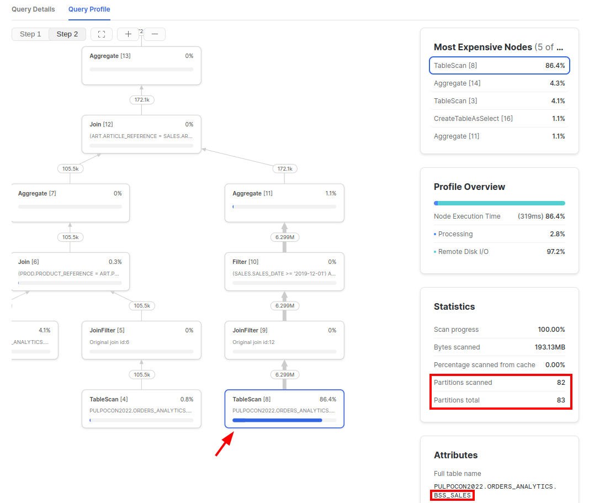

Podemos ver que el nodo más costoso es el acceso a nuestra tabla `bss_sales` y que, además, para localizar los 6 millones de datos que nos interesan estamos escaneando casi el total de sus particiones. Es decir, tenemos que recorrer completamente las ventas para seleccionar aquellos meses que nos interesan de cara al informe.

Probaremos ahora a modificar cómo generamos nuestro modelo `bss_sales` para buscar una forma de clusterizar la información que optimice su consulta posterior. Nuestros datos de venta están siempre vinculados a una fecha, así que utilizaremos esa información para indicar a Snowflake cómo debe clusterizar nuestras ventas.

3. editaremos el fichero `bss_sales.yml` de la carpeta `orders_analytics/src/model/data/sales/03-business`, donde está definida la metainformación de nuestro modelo. Añadiremos una configuración especial de clusterización, **manteniendo intacto el resto del modelo**:

~~~yml
models:
  - name: bss_sales
    description: datos finales de ventas
    config: 
      tags: ["layer:business", "visibility:public"]
      materialized: table
      cluster_by: sales_date  # <--- nueva propiedad a configurar
    
    [...]
~~~

Con esta metainformación estamos indicando a dbt y Snowflake que nuestros datos de venta deben ser almacenados atendiendo a su campo sales_date. Comprobemos cómo esto afecta a la ejecución de nuestro informe.

4. desde la consola shell y bajo la ruta `orders_analytics/src` ejecutaremos el siguiente comando para recrear nuestros datos de venta y todos los modelos posteriores:

~~~bash
dbt run -s bss_sales+
~~~

    *NOTA: usamos el `+` para indicar que deben recrearse también los
           modelos dependientes del que hemos corregido

~~~bash
Running with dbt=1.2.0
Found 14 models, 34 tests, 0 snapshots, 0 analyses, 715 macros, 0 operations, 0 seed files, 4 sources, 0 exposures, 0 metrics

Concurrency: 1 threads (target='snowflake')

1 of 5 START table model orders_analytics.bss_sales ............................ [RUN]
1 of 5 OK created table model orders_analytics.bss_sales ....................... [SUCCESS 1 in 45.56s]
2 of 5 START table model orders_analytics.articles_with_low_sales_pct_over_product_sales  [RUN]
2 of 5 OK created table model orders_analytics.articles_with_low_sales_pct_over_product_sales  [SUCCESS 1 in 3.14s]
3 of 5 START table model orders_analytics.int_ranked_products .................. [RUN]
3 of 5 OK created table model orders_analytics.int_ranked_products ............. [SUCCESS 1 in 4.12s]
4 of 5 START table model orders_analytics.age_segmentation_of_best_selling_articles  [RUN]
4 of 5 OK created table model orders_analytics.age_segmentation_of_best_selling_articles  [SUCCESS 1 in 8.55s]
5 of 5 START table model orders_analytics.best_selling_articles_by_sales_channel  [RUN]
5 of 5 OK created table model orders_analytics.best_selling_articles_by_sales_channel  [SUCCESS 1 in 1.69s]

Finished running 5 table models in 0 hours 1 minutes and 5.24 seconds (65.24s).

Completed successfully

Done. PASS=5 WARN=0 ERROR=0 SKIP=0 TOTAL=5
~~~

5. accedamos de nuevo a la vista `Activity -> Query History` de Snowflake, refresquemos la información y localizemos nuevamente la query asociada a nuestro informe `articles_with_low_sales_pct_over_product_sales` para ver cómo el cambio ha afectado a su ejecución:

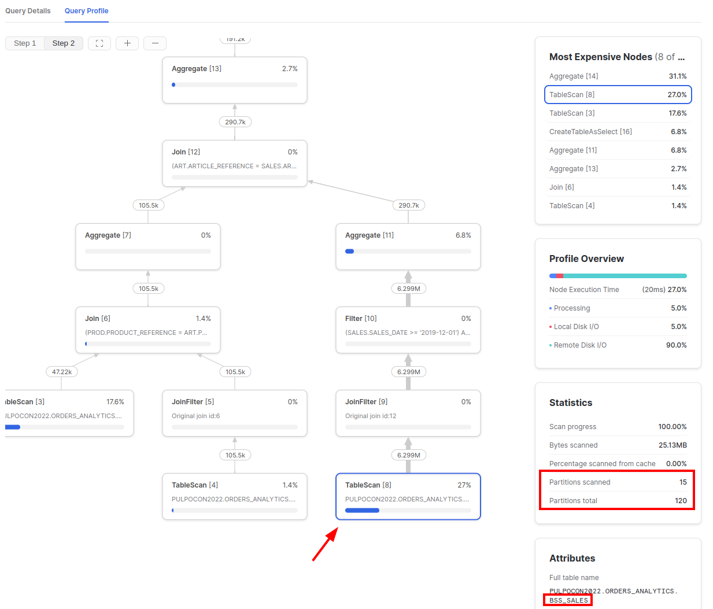

El acceso a la tabla `bss_sales` ahora supone un 27% del tiempo de ejecución del reporte y, además, Snowflake solamente necesita analizar 15 de las 120 particiones en las que ha sido clusterizado el dato para obtener los mismos 6 millones de registros.

El tiempo de cómputo del modelo `bss_sales` se ha visto incrementado al no utilizar la clusterización por defecto, pero la nueva disposición de sus datos físicamente en la base de datos optimiza la ejecución de cualquier modelo posterior, tal y como ocurre en nuestro informe de artículos con bajo porcentaje de venta, y este comportamiento será más importante cuanto mayor sea la volumetría de dato tratada.

 :octopus: <strong>Escalando verticalmente nuestro procesado</strong>

En el anterior punto cambiamos la forma de clusterizar los datos de nuestro modelo `bss_sales`, eso supuso una mejora en las consultas realizadas sobre él pero afectó a sus tiempos de cómputo, pasando de unos 25 segs a cerca de 46 segs. Este modelo es, sin duda, el que mayor carga computacional tiene asociada en nuestro caso de uso debido a la volumetría del dato en cuestión (~ 57M de tuplas). Gracias a que el modelo está aislado como un paso de nuestra *pipeline* y a que Snowflake utiliza el concepto de *virtual warehouses*, veremos cómo podemos escalar nuestro procesado de forma sencilla para tratar de reducir nuevamente los tiempos.

1. nuevamente centraremos los cambios sobre la metainformación del modelo `bss_sales`, por lo que volveremos a editar el fichero `bss_sales.yml` de la carpeta `orders_analytics/src/model/data/sales/03-business`. Añadiremos una configuración especial que nos permita escalar verticalmente nuestro cómputo en Snowflake como parte del yml del modelo y **mantendremos intacto el resto del contenido**:

~~~yml
models:
  - name: bss_sales
    description: datos finales de ventas
    config: 
      tags: ["layer:business", "visibility:public"]
      materialized: table
      cluster_by: sales_date
      snowflake_warehouse: "{{ target.user }}_WH_L"  # <--- nueva propiedad a configurar
~~~

Utilizamos una expresión [Jinja](https://jinja.palletsprojects.com/en/3.1.x/templates/#expressions) para seleccionar un *virtual warehouse* en Snowflake, ya existente y configurado para nuestro usuario, pero con un tamaño `L` en lugar del *warehouse* habitual de tamaño `XS`. Esta nuevo *warehouse* tiene mayores costes de funcionamiento, pero mayor capacidad de cómputo. Haciendo uso de la separación en capas y modelos de nuestra transformación, aplicarems el escalado vertical solo en aquel nodo de la *pipeline* que lo necesita, minimizando el impacto en los costes de ejecución.

2. desde nuestra shell ejecutaremos el siguiente comando para recrear el modelo bss_sales y comprobar cómo el escalado reduce nuevamente los tiempos de cómputo:

~~~bash
dbt run -s bss_sales
~~~

~~~bash
Running with dbt=1.2.0
Found 14 models, 34 tests, 0 snapshots, 0 analyses, 715 macros, 0 operations, 0 seed files, 4 sources, 0 exposures, 0 metrics

Concurrency: 1 threads (target='snowflake')

1 of 1 START table model orders_analytics.bss_sales ............................ [RUN]
1 of 1 OK created table model orders_analytics.bss_sales ....................... [SUCCESS 1 in 11.60s]

Finished running 1 table model in 0 hours 0 minutes and 14.44 seconds (14.44s).

Completed successfully

Done. PASS=1 WARN=0 ERROR=0 SKIP=0 TOTAL=1
~~~

Como esperábamos, el resultado de escalar verticalmente nuestro *virtual warehouse* ha supuesto una reducción drástica en el tiempo de ejecución del modelo, aprovechándose de la mayor potencia de cómputo del entorno virtual utilizado en Snowflake para transformar este paso concreto de nuestra *pipeline*.

## Recapitulando...

Algunas de las ideas que debemos tener presentes cuando trabajamos sobre grandes volumetrías:

- dividir nuestro procesamiento en bloques independientes, o capas con distintos niveles de complejidad, nos permite sacar partido a las caracterísiticas de escalabilidad de los sistemas modernos sin incurrir en costes inasumibles. Además, facilita las ejecuciones multi-hilo y el salto de rendimiento resultante.
- el comportamiento de sistemas orientados a la gestión de transacciones y múltiples inserciones/actualizaciones de datos es muy diferente al de los sistemas OLAP enfocados a la analítica de datos. Es importante conocer sus diferencias para adaptar nuestra cargas a sus características particulares.
- aunque los servicios gestionados nos abstraen de muchas complejidades, es necesario entender sus arquitecturas y formas de funcionamiento para optimizar cómo persistimos la información y cómo la explotamos de forma eficiente.
- el rendimiento en sistemas columnares es muy sensible a la cantidad de columnas y particiones de dato a procesar. Debemos adelantar el filtrado de información lo máximo posible para redducir la cantidad de dato a ser leído desde la capa física.

<!-- footer -->

&nbsp;

&nbsp;

 
    

        <a  href="../README.md" target="_top">inicio</a>
        &nbsp;&nbsp;·&nbsp;&nbsp;
        <a href="../03-testeando-modelos/README.md" target="_top">anterior</a> / 
        <a href="../05-desarrollando-orientados-a-tests/README.md" target="_top">siguiente</a>
    

    
&nbsp;

 
  
<strong>Pulpocon · 2022</strong> Construyendo pipelines de datos a escala

  
<code>rosa@nextail.co</code> <code>david.macia@nextail.co</code>

