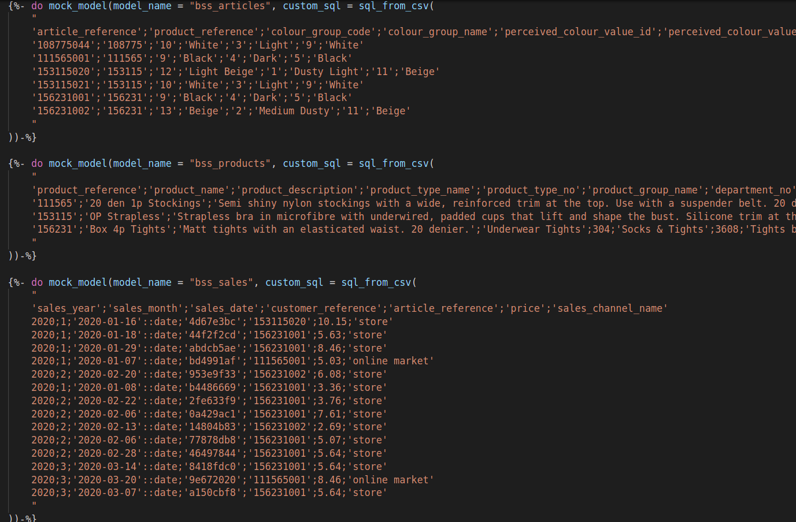
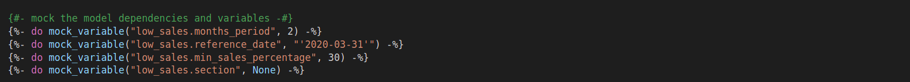
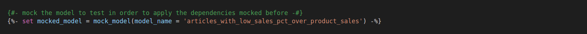
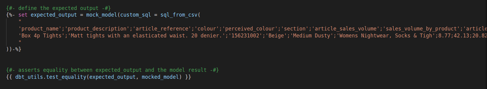
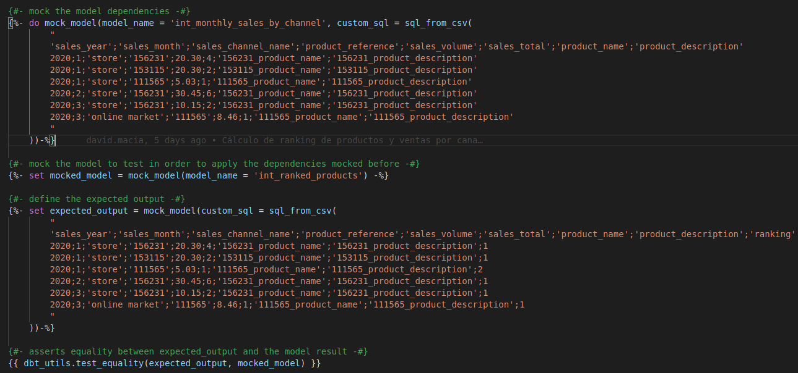

<!-- header -->
<h1 align="center">Pulpocon 2022 · Construyendo pipelines de datos a escala</h1>

 
    

        <a  href="../README.md" target="_top">inicio</a>
        &nbsp;&nbsp;·&nbsp;&nbsp;
        <a href="../04-manejando-grandes-volumetrias/README.md" target="_top">anterior</a>
    

    
&nbsp;

<!-- content -->

Esta sección requiere las modificaciones hechas en los apartados anteriores. Puedes partir de la rama `05-desarrollando-orientados-a-tests` del repositorio en caso de que no hayas podido completar alguna de ellas, eso sí, ten en cuenta lo siguiente: es imprescindible que hayas ejecutado previamente en algún momento las prácticas: [Conectando Snowflake y dbt](../00-introduccion-snowflake-dbt/README.md#octopusconectando-snowflake-y-dbt) y [Poblando de datos la capa raw](../01-procesando-en-capas/README.md#poblando-de-datos-la-capa-raw); puedes hacerlo ahora si lo necesitas.

## Desarrollo orientado a tests

La mayor parte del coste involucrado en el desarrollo de software está en la fase de mantenimiento. Debido a esto, los ingenieros de software escriben código con miras a la mantenibilidad, desarrollando tests unitarios. Sin embargo, en el código analítico, apesar de ser frágil, no es tan común desarrollar tests unitarios. Veíamos ya en secciones anteriores que los cambios en los datos subyacentes rompen la mayoría del código analítico de manera que son difíciles de predecir y corregir. Por lo tanto, es muy importante que el código analítico también sea escrito con el propósito de ser un código mantenible, y aplicar el concepto de *unit testing* cuando estamos construyendo *pipelines* de transformación de datos.

Los tests ahorran tiempo a largo plazo y se vuelven cada vez más importantes a medida que crece tu base de código. Cuanto más grande es el proyecto, más difícil es saber el impacto de un cambio.

En la sección [testeando modelos](../03-testeando-modelos/README.md), analizabamos los tests que existen para probar la salud de los datos después de que los datos hayan sido procesados. Pero en un entorno de producción, necesitaríamos también probar localmente que el comportamiento de un modelo es el esperado usando una entrada simulada y comparándola con una salida simulada esperada.

Un *framework* como dbt, aunque estamos usando *sql* como base, nos permite trabajar orientado a *unit testing*. Cabe destacar, que la separación en capas que comentábamos en una de las primeras secciones, marcando cuáles son las responsabilidades de cada una de las capas y cuáles son los límites de su ejecución, además de ayudarnos a mejorar el *performance*, también nos facilita a la hora de aplicar *unit testing*.
Es decir, no tenemos porque testear el proceso *end-to-end* de una *pipeline* completa, sino que podemos testearla unitariamente.
### ¿Cómo implemento un test unitario en transformaciones sql?

En ingeniería de *software*, un test unitario se refiere a probar una sola pieza de lógica, ya sea encapsulada en una función o método, y cada test unitario sigue el patrón **AAA (*Arrange-Act-Assert*)**, que se ha convertido casi en un estándar en toda la industria. Este patrón sugiere que cada test debe dividirse en tres fases: preparar/inicializar, actuar y confirmar (asertar). Cada una de ellas sólo es responsable de la tarea que implica su nombre.

En el contexto de los tests unitarios de sql, definimos una unidad como un modelo único, con lo que tendríamos un archivo `.sql` que seguiría el patrón *Arrange-Act-Assert*:

- :black_nib: *Arrange*: crearemos los datos de contexto o *fixtures* para construir el escenario (datos de entrada para construir el modelo) que requiere el test.
- :clapper: *Act*: invocaremos la ejecución del modelo que se está probando.
- :heavy_check_mark: *Assert*: comprobaremos si se cumplieron las expectativas, es decir, si el resultado de ese modelo es el esperado.

Como todos los patrones, no requiere que sean de obligado cumplimiento a la hora de escribir nuestros tests. Sin embargo, su uso es recomendable seguirlo como buena práctica siempre que sea posible, ya que uno de sus beneficios es que la organización de nuestros tests hace que cualquier ingeniero de *software* pueda entenderlos rápidamente. 

El testing unitario sobre SQL no es algo demasiado común, en el caso de librerías como dbt sí están surgiendo proyectos que buscan escribir los tests de forma similar a como lo haríamos en un proyecto python, por ejemplo: [dbt-test-util](https://docs.getdbt.com/docs/contributing/testing-a-new-adapter) o [pytest-dbt-core](https://github.com/godatadriven/pytest-dbt-core); pero en nuestro caso, y para no abandonar la sintaxis SQL, hemos implementado sobre dbt un prototipo de *framework de unit testing* que contiene varias macros y se apoya en macros de otros paquetes (como [dbt_utils](https://hub.getdbt.com/fishtown-analytics/dbt_utils/latest/)) con dos objetivos principales:

- Crear modelos *mock* a partir de una sentencia SQL específica para poder simular dato.
- Verificar si dos conjuntos de datos son iguales. En nuestro caso, usaremos esto para verificar la igualdad entre el resultado de ejecutar el modelo con entradas simuladas y una salida simulada esperada.

De este modo queremos poner énfasis en la importancia del test unitario, aún en escenarios en los que no es nada habitual su uso, tal y como sucede en el mundo de las *pipelines* de datos orientadas a SQL.

### ¿Cómo simulo datos de entrada y salida para probar la lógica sql?

Partiremos de datos estáticos en formato CSV para definir nuestras *fixtures* y los resultados esperados por nuestro test. Esos datos CSV serán volcados a base de datos en forma de tablas temporales que solo existan durante la ejecución de nuestros tests.

Por último, ejecutaremos un modelo en el que sus dependencias serán reemplazadas por las tablas temporales previamente creadas para, finalmente, asertar que los datos devueltos son iguales a la salida esperada definida en el test.

### ¿Cuál es una manera fácil y confiable de validar mis transformaciones sql antes de implementar mi código?

Para implementar tests unitarios sobre nuestros modelos, hemos creado un proyecto de dbt específico para *unit testing* como parte de nuestro pipeline de datos. En nuestro caso ha sido creado en el directorio `dbt/orders_analytics/test`.

Los tests unitarios de nuestros informes se encuentran en el directorio `dbt/orders_analytics/test/tests/` y el test que vamos a seguir como ejemplo se encuentra en el subdirectorio `reports/articles_with_low_sales_pct_over_product_sales`. Este test pretende validar si el resultado de los artículos con bajo rendimiento (porcentaje de ventas < 30%) vendidos en el periodo comprendido entre el 1 de febrero de 2020 y el 31 de marzo de 2020, es el resulado esperado una vez construimos el modelo correspondiente.

Si abrimos el test podemos observar cómo se implementan las fases correspondientes al patrón *Arrange-Act-Assert* y analizar cada una de ellas.

1. Generar los *fixtures* necesarios para nuestro test

Este modelo `articles_with_low_sales_pct_over_product_sales` se nutre de otros 3 modelos previos, por lo que tendremos 3 modelos *mock* como dependencias:

Además, el modelo tiene inyectadas varias variables para poder configurar el set de resultados, por lo que también tendremos que simular esas variables:

2. Ejecutar el modelo a probar utilizando las dependencias simuladas antes.

3. Definir la salida esperada del modelo a validar y asertar la igualdad entre la salida_esperada y el resultado del modelo

### Presentando el caso de uso a validar unitariamente

Como parte de la capa de *reporting* queremos disponer de un informe que nos devuelva el top de productos más vendidos por mes y por canal de venta. 

Siguiendo el criterio de *divide y vencerás* que ya hemos comentado, esta lógica más compleja la hemos troceado en lógicas más simples:

1. Un primer modelo intermedio para obtener las ventas mensuales por producto y canal de venta. 
     - modelo `int_monthly_sales_by_channel.sql` en directorio `orders_analytics/src/models/reports/intermediate`.
     - test `int_monthly_sales_by_channel_test.sql` en directorio `orders_analytics/test/tests/intermediate/int_monthly_sales_by_channel`.
  
2. Un segundo modelo intermedio para obtener el ranking de productos por mes y canal de venta, partiendo del cálculo de volúmen mensual de ventas computado en el modelo anterior.
   - modelo `int_ranked_products.sql` en directorio `orders_analytics/src/models/reports/intermediate`.
   - test `int_ranked_products_test.sql` en directorio `orders_analytics/test/tests/intermediate/int_ranked_products`.

3. Un último modelo que construye el informe de negocio final, en el que filtrar por ese ranking y mostrar el top1, top5, top10, etc. de productos. 
   - modelo `best_selling_articles_by_sales_channel.sql` en directorio `orders_analytics/src/models/reports/best_selling_articles_by_sales_channel`.
   - test `best_selling_articles_by_sales_channel_test.sql` en directorio `orders_analytics/test/tests/reports/best_selling_articles_by_sales_channel`.

A continuación tendremos que implementar el modelo final usando una buena práctica de desarrollo de software llamada **TDD** (*Test-Driven Development*), que consiste en escribir primero los tests unitarios, después escribir el código fuente para que pase el test  satisfactoriamente y, por último, refactorizar el código escrito.

Este ciclo también se conoce como **rojo** (hacer que el test falle), **verde** (hacer que el test pase) y **refactor**.

En nuestro caso, por disponer de un tiempo limitado en el taller, nos hemos visto obligados a acortar este ciclo y hemos realizado ya los tests y una primera implementación de los 2 modelos intermedios y el modelo final. Estaríamos ya en la fase de **rojo**.

 :octopus: <strong>Desarrollando orientado a tests</strong>

Siguiendo el ciclo TDD, hemos escrito los tests, hemos implementado los modelos y tenemos que comprobar que nuestra implementación es correcta ejecutando los tests.

1.  Dentro de nuestra shell, ejecutaremos nuestros tests desde la carpeta `test` del proyecto `orders_analytics` utilizando los siguientes comandos:

~~~bash
cd /opt/pulpo22/orders_analytics/test
dbt deps
~~~

~~~bash
dbt test --store-failures
~~~

~~~bash
Running with dbt=1.2.0
Found 14 models, 5 tests, 0 snapshots, 0 analyses, 566 macros, 2 operations, 0 seed files, 4 sources, 0 exposures, 0 metrics

Running 1 on-run-start hook
1 of 1 START hook: orders_analytics_test.on-run-start.0 ........................ [RUN]
1 of 1 OK hook: orders_analytics_test.on-run-start.0 ........................... [OK in 0.00s]

Concurrency: 1 threads (target='snowflake')

[...]
5 of 5 START test int_ranked_products_test ..................................... [RUN]
5 of 5 FAIL 2 int_ranked_products_test ......................................... [FAIL 2 in 4.99s]

Running 1 on-run-end hook
1 of 1 START hook: orders_analytics_test.on-run-end.0 .......................... [RUN]
1 of 1 OK hook: orders_analytics_test.on-run-end.0 ............................. [OK in 0.00s]

Finished running 5 tests, 2 hooks in 0 hours 0 minutes and 34.00 seconds (34.00s).

Completed with 1 error and 0 warnings:

Failure in test int_ranked_products_test (tests/intermediate/int_ranked_products/int_ranked_products_test.sql)
  Got 2 results, configured to fail if != 0

  compiled SQL at target/compiled/orders_analytics_test/tests/intermediate/int_ranked_products/int_ranked_products_test.sql

  See test failures:
  ---------------------------------------------------------------------------------------------
  select * from orders_analytics_test_dbt_test__audit.int_ranked_products_test
  ---------------------------------------------------------------------------------------------
  
Done. PASS=4 WARN=0 ERROR=1 SKIP=0 TOTAL=5
~~~

2. Observamos un error en el comportamiento esperado en el modelo `int_ranked_products`, el test nos informa de que existen diferencias entre lo esperado y el resultado de la ejecución. Para descubrir los errores concretos, ejecutaremos en Snowflake la consulta mostrada en el log:

~~~sql
select * from orders_analytics_test_dbt_test__audit.int_ranked_products_test
~~~

|WHICH_DIFF|SALES_YEAR   |SALES_MONTH|SALES_CHANNEL_NAME |PRODUCT_REFERENCE  |SALES_VOLUME   |SALES_TOTAL|PRODUCT_NAME       |PRODUCT_DESCRIPTION        |RANKING   |
|----------|-------------|-----------|-------------------|-------------------|---------------|-----------|-------------------|---------------------------|----------|
|a_minus_b |2020         |1          |store              |111565             |5.03           |1          |111565_product_name|111565_product_description |2         |     
|b_minus_a |2020         |1          |store              |111565             |5.03           |1          |111565_product_name|111565_product_description |3         |

En nuestro test la salida esperada es que el producto `111565`, en el año `2020`, mes `1` y canal `store` tenga el ranking 2, pero sin embargo la salida generada por el modelo es un 3.

<em>Fig - implementación del test unitario int_ranked_products_test </em>

A la hora de establecer un ranking, nos encontramos con la necesidad de agrupar datos, ordernarlos según un criterio y asignarles un número según su posición dentro del grupo: el ranking que queremos calcular. Para cubrir esta necesidad, sql nos ofrece diferentes funciones de ventanado y ranking:

~~~sql
ROW_NUMBER() OVER([PARTITION BY colums1] ORDER BY colums2) 
DENSE_RANK() OVER([PARTITION BY colums1] ORDER BY colums2)
RANK() OVER([PARTITION BY colums1] ORDER BY colums2)
~~~

Las 3 funciones ordenan por el criterio establecido por `colums2` dentro del grupo `colums1` y enumeran los resultados, pero tienen matices diferentes:

- **ROW_NUMBER**: genera una clasificación siempre incremental, donde a cada elemento se le asigna un número en función de su orden. Nunca genera rankings con duplicados.
- **RANK**: genera una clasificación ordenada en la que puede haber duplicados. Cuando dos elementos comparten el mismo ranking, se genera un salto en la secuencia y al siguiente elemento se le asigna un valor no consecutivo. Si, por ejemplo, dos elementos comparten la primera posición del ranking al siguiente se le asigna la posición 3, quedando libre la segunda.
- **DENSE_RANK**: genera una claisificación ordenada en la que puede haber duplicados, tal y como ocurre con la función RANK, pero en este caso no no se generan huecos y la clasificación siempre se comporta de forma secuencial. Aún si dos elementos comparten la primera posición, al siguiente en la secuencia le será asignado el número 2.
 
En nuestro modelo, al usar la función de ventanado RANK() se están produciendo saltos en la clasificación debido al empate en ventas mensuales de los articulos `156231` y `153115` en el año `2020`, mes `1` y canal `store`. Debemos cambiar la definición del modelo para adecuarlo al comportamiento esperado.

3. Editaremos el modelo `int_ranked_products.sql` para cambiar la función de ventanado a DENSE_RANK():

~~~sql
-- Product sells ranked by date and sales_channel
SELECT
    ms.sales_year,
    ms.sales_month,
    ms.sales_channel_name,
    ms.product_reference,
    ms.product_name, 
    ms.product_description,
    ms.sales_volume,
    ms.sales_total,
    DENSE_RANK() OVER (PARTITION BY ms.sales_year, ms.sales_month, ms.sales_channel_name
                       ORDER BY ms.sales_volume DESC) AS ranking
FROM
    {{ ref('int_monthly_sales_by_channel') }} ms
~~~

4. Ejecutaremos de nuevo nuestros tests mediante el comando `dbt test`, para validar el comportamiento tras los cambios:

~~~bash
Running with dbt=1.2.0
Found 14 models, 5 tests, 0 snapshots, 0 analyses, 566 macros, 2 operations, 0 seed files, 4 sources, 0 exposures, 0 metrics

Running 1 on-run-start hook
1 of 1 START hook: orders_analytics_test.on-run-start.0 ........................ [RUN]
1 of 1 OK hook: orders_analytics_test.on-run-start.0 ........................... [OK in 0.00s]

Concurrency: 1 threads (target='snowflake')

[...]
5 of 5 START test int_ranked_products_test ..................................... [RUN]
5 of 5 PASS int_ranked_products_test ........................................... [PASS in 7.19s]

Running 1 on-run-end hook
1 of 1 START hook: orders_analytics_test.on-run-end.0 .......................... [RUN]
1 of 1 OK hook: orders_analytics_test.on-run-end.0 ............................. [OK in 0.00s]

Finished running 5 tests, 2 hooks in 0 hours 0 minutes and 49.68 seconds (49.68s).

Completed successfully

Done. PASS=5 WARN=0 ERROR=0 SKIP=0 TOTAL=5
~~~

Observamos cómo ahora nuestro modelo se comporta correctamente y pasan todos los tests.
Volveremos a construir de nuevo el modelo corregido (y sus modelos dependientes) para aplicar el cambio en los datos publicados.

5. Ejecutaremos los siguientes comandos para situarnos en la carpeta `src` del proyecto y reconstruir los modelos.

~~~bash
cd /opt/pulpo22/orders_analytics/src
dbt run -s int_ranked_products+
~~~

    *NOTA: usamos el `+` para indicar que deben recrearse también los
           modelos dependientes del que hemos corregido

Tras las correcciones ya estaríamos en fase **verde** y habríamos garantizado que la lógica implementada por nuestro modelo se adecúa a lo definido. En el taller hemos ejecutado estos test unitarios sobre modelos ya construidos y tras haber materializado sus datos; en un ciclo de desarrollo normal la aplicación de estas técnicas de *TDD* se llevaría a cabo durante la fase de construcción de los modelos, tanto en su primera implementación como en cualquier iteración posterior que requiera un cambio en su lógica, pero siempre antes de la materialización final del modelo y la exposición de sus datos a posibles consumidores.

&nbsp;

## Recapitulando...

La aplicación de *unit testing* como parte del desarrollo de una *pipeline* de datos, incluso si esta está orientada al SQL, nos ayuda no solo a validar la salud de nuestros modelos, sino a mantener los ciclos de desarrollo más cortos y evitar modificaciones no intencionadas. 

Esta sería la última de las buenas prácticas propias de la ingeniería de software que, a lo largo del taller, hemos querido poner en valor como herramientas imprescindibles para construir una *pipeline* de datos a escala. Un flujo de transformación capaz de procesar grandes volúmenes de forma eficiente, pero poniendo el foco también en cómo esos datos deben ser diseñados para que puedan escalar, cómo deben ser testados para garantizar su calidad y minimizar errores, cómo deben ser documentados para potenciar la autonomía de sus posibles consumidores y, en definitiva, cómo tratar la información de manera que esta adquiera verdadero valor y su gestión resulte gobernable, confiable y sostenible.

<!-- footer -->

&nbsp;

&nbsp;

 
    

        <a  href="../README.md" target="_top">inicio</a>
        &nbsp;&nbsp;·&nbsp;&nbsp;
        <a href="../04-manejando-grandes-volumetrias/README.md" target="_top">anterior</a>
    

    
&nbsp;

 
  
<strong>Pulpocon · 2022</strong> Construyendo pipelines de datos a escala

  
<code>rosa@nextail.co</code> <code>david.macia@nextail.co</code>

