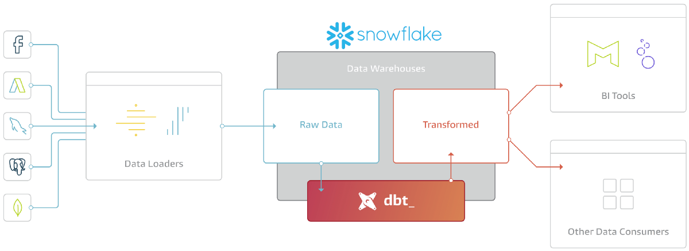
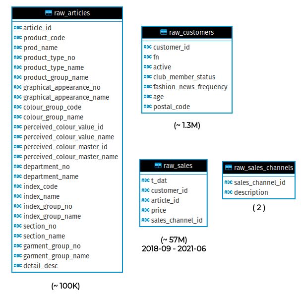
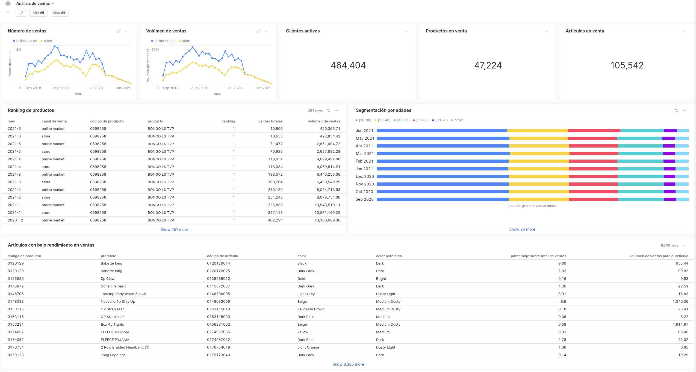

# Pulpocon 2022 · Construyendo pipelines de datos a escala

Buenas prácticas y estrategias recomendadas para la construcción de *pipelines* de datos a escala.

## Introducción al taller

En el escenario actual, tanto tecnológico como económico, la toma de decisiones basadas en el análisis e interpretación de datos es una pieza fundamental para cualquier organización. No son pocos los retos que esto supone: desde la complejidad propia de la información o las grandes volumetrías que se suelen manejar, hasta la correcta gestión del ciclo de vida del dato, el control de su calidad o la construcción de pipelines robustas, observables y fácilmente escalables.

En los últimos años han aparecido una serie de soluciones que surgen de distintos proyectos *open source* y buscan dar respuesta a cada uno de estos problemas, lo que comúnmente se conoce como el *modern data stack*. Muchas de las arquitecturas construidas sobre esta base tecnológica utilizan **dbt**, una librería de gestión y transformación de datos basada en SQL, como una pieza central que permite la colaboración eficiente entre equipos de ingenieros y data scientists; además de acercar al contexto de los datos las buenas prácticas más comunes del mundo del desarrollo de software: observabilidad, testing o automatización.

<em>Fig - encaje de dbt en el modern data stack</em>

En este taller discutiremos cómo **dbt** y un data warehouse de nueva generación como **Snowflake** nos permiten diseñar una solución para el análisis de datos que haga énfasis no solo en el rendimiento, sino también en aplicar una serie de estrategias recomendadas para alcanzar una gestión simple, escalable y sostenible de la información. No pretende ser un curso en profundidad sobre dbt o Snowflake, sino una oportunidad para que discutamos sobre algunos de los puntos clave que nos deben permitir construir *pipelines* de datos sea cual sea la volumetría manejada y sea cual sea la complejidad del escenario a tratar.

## Nuestro caso de uso

A lo largo del taller estaremos trabajando sobre una versión adaptada y enriquecida de unos datos anonimizados del grupo H&M que sirvieron como base a una [competición en Kaggle](https://www.kaggle.com/competitions/h-and-m-personalized-fashion-recommendations/data).

<em>Fig - dataset base con ventas, clientes y productos</em>

&nbsp;

Este *dataset* contiene información sin procesar acerca de:
- catálogo de productos y artículos (~ 100.000 tuplas)
- datos de clientes (~ 1.300.000 tuplas)
- información histórica de ventas (~ 57.000.000 tuplas)

Y a partir de él iremos construyendo una *pipeline* de transformación de datos que nos permita responder a las siguientes preguntas y sirva, por lo tanto, como fuente de datos fiable para un *dashboard* de análisis de venta como el que representamos a continuación:
- ¿cómo han evolucionado las ventas a lo largo del tiempo? ¿se han comportado igual los distintos canales de venta?
- ¿cuáles han sido los productos más vendidos?
- ¿qué segmentos de edad compran nuestros productos? 
- ¿existen artículos, tallas o colores, con un rendimiento de ventas inferior al esperado?
  
El reto al que nos enfrentamos, y sobre el que discutiremos, será procesar el *dataset* de una forma eficiente, mantenible y observable.

<em>Fig - ejemplo de dashboard sobre el resultado final de nuestra pipeline</em>

&nbsp;

## Comenzando...

Hemos dividido el taller en las siguientes secciones. En cada una de ellas intentaremos poner el foco en un aspecto clave de la gestión del dato y realizaremos algunos ejercicios que pongan en práctica lo comentado:

- [presentando Snowflake y dbt](00-introduccion-snowflake-dbt/README.md), donde introduciremos las tecnologías base del taller y el porqué de su selección
- [procesando en capas](01-procesando-en-capas/README.md), donde trataremos de aplicar eso de *divide y vencerás*
- [documentando nuestras transformaciones](02-documentando-la-pipeline/README.md), porque el resultado de nuestra *pipeline* de datos solo es válido si es fácilmente consumible por terceros
- [añadiendo tests a nuestros modelos](03-testeando-modelos/README.md), donde buscaremos ganar observabilidad y confianza sobre nuestro trabajo
- [estrategias ante grandes volumetrías de datos](04-manejando-grandes-volumetrias/README.md), porque la exigencia de los escenarios a los que nos tenemos que enfrentar aumenta cada día
- [desarrollo orientado a tests](05-desarrollando-orientados-a-tests/README.md), donde intentaremos demostrar que las buenas prácticas propias de *TDD* (*Test Driven Development*) son posibles en el mundo de los datos y el SQL

<!-- footer -->

&nbsp;

&nbsp;

 
  
<strong>Pulpocon · 2022</strong> Construyendo pipelines de datos a escala

  
<code>rosa@nextail.co</code> <code>david.macia@nextail.co</code>

